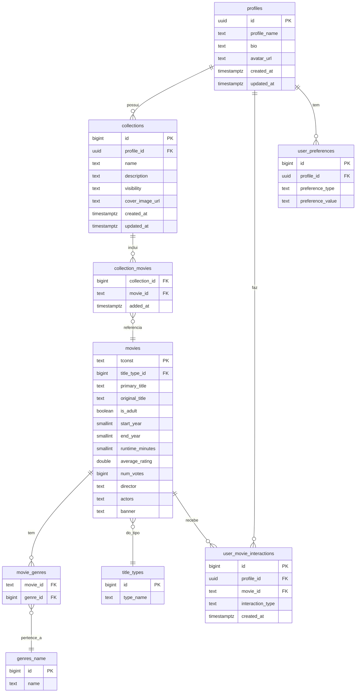

# 8. Visão de Dados (opcional)

## 8.1 Diagrama Entidade-Relacionamento (ER)

## 8.2 Melhorias Técnicas Recomendadas

- **Timestamps:** padronizar todas as colunas de data para `timestamptz DEFAULT now()`, garantindo consistência temporal em UTC.  
- **Índices:** criar índices para colunas de chave estrangeira e de filtro frequente (`profile_id`, `movie_id`, `genre_id`, `title_type_id`, `average_rating`, `num_votes`) para otimizar desempenho.  
- **UNIQUE compostas:** aplicar restrições em `(profile_id, movie_id)` em `user_movie_interactions` e `(profile_id, preference_type, preference_value)` em `user_preferences` para prevenir duplicações lógicas.  
- **ON DELETE:** definir políticas adequadas (`CASCADE` ou `SET NULL`) nas FKs derivadas de `profiles` e `collections` para evitar registros órfãos.  
- **Vetores:** planejar migração futura de campos de vetor (usuários e filmes) para o tipo **pgvector**, permitindo consultas vetoriais mais eficientes em recomendações.  
