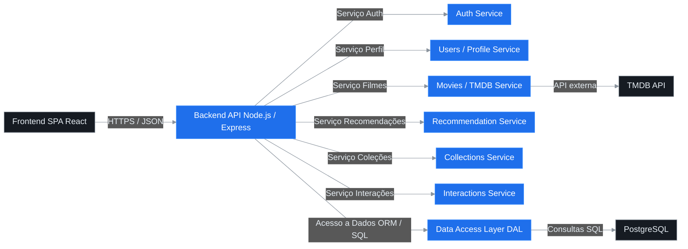
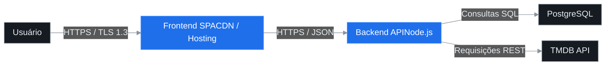

# 1. Introdução

## 1.1 Finalidade

Este documento tem como finalidade descrever a arquitetura de software do sistema **ReelStack**, detalhando sua estrutura lógica, componentes, integrações e decisões arquiteturais que sustentam seu funcionamento. O objetivo é assegurar que todos os envolvidos no desenvolvimento, manutenção e evolução do sistema possuam uma visão unificada e tecnicamente fundamentada sobre sua concepção, atendendo aos requisitos funcionais e não funcionais especificados.

## 1.2 Escopo

O **ReelStack** é uma aplicação **web-first** voltada à recomendação personalizada de filmes, permitindo que usuários expressem preferências por meio de interações do tipo *swipe* (like/dislike), formem coleções temáticas e recebam sugestões baseadas em similaridade e histórico de interações.  
O sistema integra-se exclusivamente à API **TMDB (The Movie Database)** para obtenção de metadados de filmes, e utiliza autenticação via e-mail e senha. O backend opera sobre banco de dados **PostgreSQL**, conforme o esquema definido no artefato `schema.sql`. O sistema é protegido por autenticação **JWT**, comunicação segura via **TLS 1.3** e políticas de **Row-Level Security (RLS)** quando aplicável.

## 1.3 Definições, Acrônimos e Abreviações

| Termo | Definição |
|-------|------------|
| **API** | Interface de Programação de Aplicações, utilizada para integração com serviços externos. |
| **JWT** | *JSON Web Token*, padrão para autenticação e autorização baseada em tokens. |
| **TMDB** | *The Movie Database*, serviço externo de metadados de filmes e séries. |
| **RLS** | *Row-Level Security*, política de segurança em nível de linha do PostgreSQL. |
| **ETL** | *Extract, Transform, Load*, processo de extração, transformação e carga de dados. |
| **ReelStack** | Sistema de recomendação e gerenciamento de coleções de filmes desenvolvido neste projeto. |

## 1.4 Referências

- **REQUISITO_SOFTWARE.md** – Documento de requisitos funcionais, não funcionais e regras de negócio do projeto ReelStack.  
- **schema.sql** – Artefato contendo o esquema relacional completo do banco de dados PostgreSQL.  
- **Template_DocumentoArquiteturaSoftware.docx** – Modelo base utilizado para a estruturação deste documento conforme o método RUP/4+1.

# 2. Requisitos e Restrições da Arquitetura

A seguir são apresentados os principais requisitos e restrições arquiteturais do sistema **ReelStack**, definidos a partir dos requisitos funcionais, não funcionais e regras de negócio documentados.

| Categoria | Descrição | Decisão Arquitetural / Restrição |
|------------|------------|----------------------------------|
| **Linguagem / Plataforma** | O sistema deve ser web-first, priorizando compatibilidade com navegadores modernos e dispositivos móveis. | Implementação em **TypeScript/JavaScript (Node.js)** no backend e **React** no frontend. Arquitetura RESTful e comunicação via HTTPS. |
| **Segurança** | O acesso deve ser autenticado e autorizado de forma segura. | Utilização de **JWT (JSON Web Token)** para autenticação, **TLS 1.3** para criptografia de tráfego e **RLS (Row-Level Security)** no PostgreSQL para controle de acesso por perfil. |
| **Persistência** | O sistema deve armazenar dados de usuários, filmes, coleções e interações de forma consistente e rastreável. | Banco de dados **PostgreSQL**, conforme o artefato `schema.sql`. Tabelas normalizadas, chaves primárias compostas e *foreign keys* explícitas. |
| **Internacionalização** | O conteúdo deve ser adaptável a múltiplos idiomas. | MVP restrito ao idioma **português (pt-BR)**. Estrutura preparada para futura integração de i18n no frontend. |
| **Integração Externa (TMDB)** | Os metadados de filmes devem ser obtidos de fonte externa. | Integração exclusiva com a **API TMDB**, utilizando chave de acesso segura e cache local para otimização de requisições. |
| **Desempenho** | O sistema deve manter boa responsividade sob carga moderada. | Meta de **p90 ≤ 1s** de tempo de resposta com **até 100 usuários simultâneos** no MVP. Uso de cache em memória (Redis opcional) e otimização de consultas SQL. |
| **Manutenibilidade / Padronização** | O código deve seguir boas práticas e padrões de desenvolvimento. | Adoção de **ESLint**, **Prettier**, **TypeScript**, *design patterns* RESTful e versionamento semântico. Estrutura modular para facilitar testes e refatorações. |
| **Dependências / Infraestrutura** | A solução deve operar em ambiente escalável e seguro. | Implantação em **nuvem (AWS ou Supabase)**, com **PostgreSQL gerenciado** e suporte a **CI/CD** via GitHub Actions. Dependências gerenciadas por **npm**. |

<div style="text-align: right;">
<em>Tabela 1 – Requisitos e Restrições da Arquitetura do ReelStack</em>
</div>

# 3. Visão de Casos de Uso

O sistema **ReelStack** permite que o usuário autenticado descubra filmes personalizados por meio de interações do tipo *swipe* (curtir ou rejeitar), visualize recomendações com base em seu histórico, gerencie coleções de filmes e compartilhe listas públicas. O administrador possui acesso restrito para fins de manutenção e auditoria de dados. Os principais casos de uso refletem as jornadas essenciais do produto no MVP, priorizando a simplicidade, o desempenho (RNF-002) e a clareza nas mensagens de erro e sucesso (RNF-004).

## 3.1 Diagrama de Casos de Uso (Visão Geral)


## 3.2 Mapeamento de Casos de Uso, Regras de Negócio e RNFs

| Caso de Uso | Regras de Negócio Associadas | RNFs Relevantes |
|--------------|------------------------------|------------------|
| **UC1 – Autenticar-se** | RN-001 (Autenticação via e-mail/senha) | RNF-001 (Segurança com TLS/JWT), RNF-004 (Mensagens claras) |
| **UC2 – Visualizar recomendações** | RN-002 (Geração de recomendações personalizadas), RN-005 (Uso de histórico e preferências) | RNF-002 (Desempenho p90 ≤ 1s), RNF-004 |
| **UC3 – Curtir ou rejeitar filme** | RN-003 (Registro único por interação), RN-004 (Atualização do histórico) | RNF-002, RNF-004 |
| **UC4 – Gerenciar coleções** | RN-006 (CRUD de coleções), RN-007 (Controle de visibilidade pública/privada/não listada) | RNF-003 (Persistência consistente), RNF-004 |
| **UC5 – Visualizar histórico de curtidas** | RN-004 (Histórico atualizado em tempo real) | RNF-002, RNF-004 |
| **UC6 – Compartilhar coleção** | RN-007 (Coleções públicas podem ser compartilhadas) | RNF-001 (Segurança), RNF-004 |
| **UC7 – Administrar base de filmes** | RN-008 (Manutenção e auditoria do catálogo) | RNF-001 (Segurança), RNF-005 (Integridade dos dados) |

<div style="text-align: right;">
<em>Tabela 2 – Mapeamento entre Casos de Uso, Regras de Negócio e RNFs</em>
</div>

# 4. Visão Lógica

## 4.1 Visão Geral

A arquitetura lógica do **ReelStack** é estruturada em camadas independentes e coesas, visando modularidade, segurança e desempenho. O sistema adota uma abordagem **web-first**, com frontend em **SPA (Single Page Application)** comunicando-se via **HTTPS/JSON** com um backend em **API RESTful**, que integra serviços especializados de autenticação, recomendação e persistência. O **PostgreSQL** é utilizado como camada final de armazenamento, garantindo integridade referencial e suporte a políticas de **Row-Level Security (RLS)**.



Cada camada desempenha um papel definido:

- **Frontend SPA**: responsável pela interação com o usuário, fornecendo uma experiência fluida e responsiva. Implementa cache local e chamadas assíncronas para otimizar desempenho (NFR-002).
- **Backend API**: centraliza a lógica de negócios e a integração entre módulos. Utiliza autenticação JWT e HTTPS (TLS 1.3) para comunicação segura (NFR-001), e divide responsabilidades em micro-serviços internos, permitindo escalabilidade horizontal.
- **Camada de Acesso a Dados (DAL)**: encapsula consultas SQL e transações, garantindo integridade e rastreabilidade. Usa índices e *prepared statements* para reduzir latência (NFR-002).
- **Banco PostgreSQL**: provê armazenamento relacional seguro com controle de acesso granular (RLS), assegurando consistência e isolamento de dados.

## 4.2 Pacotes de Design Significativos

| Pacote / Componente | Descrição e Responsabilidades | Decisões de Integridade / Regras de Negócio |
|----------------------|-------------------------------|---------------------------------------------|
| **Auth Controller / Service** | Gerencia autenticação via e-mail/senha, emissão e verificação de JWT. | Garante conformidade com **RN-001**; tokens expiram após tempo definido; falhas autenticadas registradas para auditoria. |
| **Users / Profile Service** | Mantém dados de perfis e preferências; integra RLS para segurança por perfil. | Usa RLS em consultas; evita duplicação de nomes de perfil; segue **RN-006**. |
| **Movies / Metadata Service** | Integra com a API **TMDB** para recuperar metadados de filmes; mantém cache local para reduzir chamadas externas. | Cache TTL de 24h; controle de atualização assíncrona; segue **RN-005**. |
| **Recommendation Service** | Gera recomendações personalizadas com base no histórico e vetores de similaridade. | Baseado em **RN-002**; operações idempotentes; cálculos em batch para desempenho. |
| **Interactions Service** | Registra curtidas e rejeições (*like/dislike*) e atualiza vetores de recomendação. | Garante unicidade por filme e perfil (**RN-003**); utiliza transações para atomicidade. |
| **Collections Service** | Criação, atualização, remoção e compartilhamento de coleções de filmes. | Enforce de visibilidade (**RN-007**); controle transacional em exclusões e adições múltiplas. |
| **Error Handling Module** | Padroniza respostas de erro da API, garantindo mensagens claras e consistentes. | Atende **NFR-004** (mensagens compreensíveis e rastreáveis). |
| **Data Access Layer (DAL)** | Implementa abstração para o acesso a dados, isolando consultas SQL e lógica de persistência. | Usa transações ACID; validações de integridade referencial; suporte a rollback em falhas. |

<div style="text-align: right;">
<em>Tabela 3 – Pacotes de Design Significativos do ReelStack</em>
</div>

# 5. Visão de Processos (opcional)

O **ReelStack** adota um modelo de concorrência baseado em **API stateless**, onde cada requisição é independente e contém suas credenciais de autenticação via **JWT**. As operações críticas sobre o banco de dados utilizam **transações curtas e atômicas**, garantindo integridade sem manter bloqueios prolongados.  
Processos assíncronos são utilizados para **recomputar vetores de recomendação de usuários** com base em novas interações, podendo ocorrer de forma agendada (*batch*) fora do ciclo principal de requisição. Em futuras iterações, poderá ser introduzido um sistema de **filas de mensagens** (ex.: RabbitMQ, Redis Queue) para balancear cargas. No MVP, o processamento assíncrono é simplificado e executado sob demanda pelo backend.

# 6. Visão de Implantação

## 6.1 Diagrama de Implantação



## 6.2 Variáveis de Ambiente

| Variável | Descrição |
|-----------|------------|
| **TMDB_KEY** | Chave de autenticação para integração com a API TMDB. |
| **DB_URL** | URL de conexão segura ao banco de dados PostgreSQL. |
| **JWT_SECRET** | Chave secreta usada para assinatura e verificação de tokens JWT. |

<div style="text-align: right;">
<em>Tabela 4 – Checklist de Implantação do ReelStack</em>
</div>

## 6.3 Checklist de Implantação

1. **Build do Frontend:** gerar versão otimizada da SPA (ex.: `npm run build`) e publicar em hosting/CDN.  
2. **Migração do Banco:** executar scripts de criação (`schema.sql`) e migrações adicionais.  
3. **Aplicar Políticas RLS:** configurar *Row-Level Security* em tabelas com dados de perfil.  
4. **Implantação da API:** iniciar backend configurando variáveis de ambiente e logs seguros.  
5. **Verificação de TLS:** garantir comunicação HTTPS com certificado TLS 1.3 ativo.  
6. **Testes Finais:** validar autenticação, acesso ao banco, integração TMDB e endpoints críticos.  

# 7. Visão da Implementação (opcional)

A implementação do **ReelStack** segue uma estrutura modular e organizada por contexto de responsabilidade, garantindo manutenibilidade e clareza entre camadas. O projeto é estruturado conforme o padrão monorepo simplificado:

```bash
/apps
├── /frontend      # SPA em React (Next.js ou Vite)
└── /api           # API REST Node.js / Express
/packages
└── /shared        # Tipos TypeScript, DTOs, utilitários e contratos OpenAPI
/infra
├── docker/        # Configuração de containers e banco
├── migrations/    # Scripts SQL de schema e seeds
└── ci-cd/         # Pipelines de build e deploy
```

O contrato entre **frontend** e **backend** será formalizado por meio de **OpenAPI (Swagger)**, assegurando consistência entre clientes e serviços (detalhado no Apêndice).  
As convenções de código incluem:

- **ESLint** e **Prettier** para padronização e formatação automática.  
- Comentários de documentação (`JSDoc` / `TypeDoc`) em funções públicas e APIs.  
- Testes unitários com **Jest**, priorizando funções críticas.  
- Versionamento semântico e *commit linting* para controle evolutivo.  

---

# 8. Volume e Desempenho

## 8.1 Metas do MVP

- Suporte a até **100 usuários simultâneos** com respostas médias adequadas.  
- **Tempo de resposta p90 ≤ 1s** para operações de interação (*swipe*, curtir/rejeitar).  

## 8.2 Táticas de Desempenho

- Criação de **índices** sobre colunas-chave (`profile_id`, `movie_id`, `genre_id`).  
- Aplicação de **filtros de candidatos** com base em métricas como `num_votes` e `average_rating`.  
- Envio de **payloads enxutos** em respostas JSON (sem campos não utilizados).  
- Ativação de **compressão HTTP (gzip ou brotli)**.  
- Implementação de **cache leve** para sinopses e metadados de filmes da TMDB.  
- Adoção de **API stateless** e *connection pooling* no banco de dados para escalabilidade.  

## 8.3 Validação de Desempenho

Os testes de carga e desempenho serão conduzidos com **JMeter**, avaliando métricas de latência (p90, p95), throughput e uso de recursos. Logs estruturados e métricas de API (ex.: Prometheus + Grafana) permitirão verificar conformidade com os **Requisitos Não Funcionais (RNF-002)** e **RNF-003** de desempenho e estabilidade.

# 9. Qualidade

| Atributo | Descrição | Solução Aplicada |
|-----------|------------|------------------|
| **Escalabilidade** | Capacidade de lidar com aumento gradual de usuários e requisições. | Arquitetura **stateless** com API REST e banco **PostgreSQL gerenciado**; uso de *connection pooling* e possibilidade de horizontalização futura do backend. |
| **Confiabilidade** | Garantia de integridade e consistência das operações. | Uso de **transações ACID**, restrições **UNIQUE** e *foreign keys*; rollback automático em falhas e versionamento controlado de schema. |
| **Disponibilidade** | Manutenção do serviço acessível e responsivo ao usuário. | Hospedagem em ambiente de **nuvem** com monitoramento e *uptime* contínuo; fallback simples em cache local e CDN para frontend. |
| **Portabilidade** | Facilidade de implantação em diferentes infraestruturas. | Implementação em **Node.js** e **React**, dependências padrão e imagens **Docker** multiplataforma; compatibilidade com múltiplos provedores de nuvem. |
| **Segurança** | Proteção de dados, autenticação e controle de acesso. | Comunicação **TLS 1.3**, autenticação **JWT**, e **RLS (Row-Level Security)** no PostgreSQL; políticas de acesso e encriptação de dados sensíveis. |

A arquitetura de qualidade do **ReelStack** assegura conformidade com os **Requisitos Não Funcionais (RNFs)** de desempenho, segurança e disponibilidade, além de reforçar o atendimento das **Regras de Negócio (RNs)** ligadas à integridade dos dados, controle de acesso e consistência das recomendações. Essa base técnica garante estabilidade operacional e suporte sustentável à evolução do sistema.
