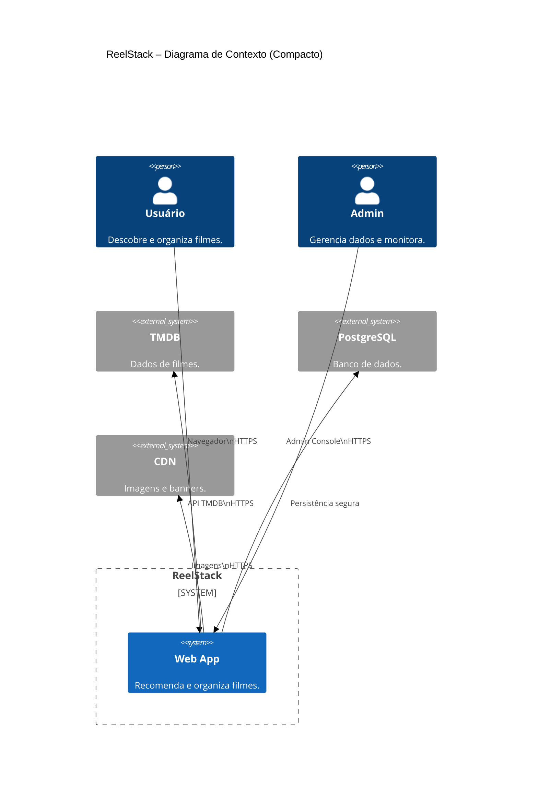

**Descrição do Contexto e Limites**

O **ReelStack** é um sistema **web-first** que centraliza as funcionalidades de descoberta, recomendação e organização de filmes, fornecendo uma experiência de uso fluida baseada em gestos de swipe. Ele atua como intermediário entre o **usuário final**, que realiza interações como curtir, rejeitar e criar coleções, e as fontes externas de dados e mídia — notadamente a **API do TMDB**, utilizada como fonte exclusiva de metadados conforme a RN-005, e uma **CDN de imagens**, responsável pela entrega rápida de recursos visuais. Todas as interações entre navegador e sistema ocorrem via **HTTPS/TLS 1.3**, garantindo a proteção dos dados em trânsito e atendendo ao requisito não funcional de **segurança**.
O **Administrador** acessa o sistema por meio de um painel protegido, dedicado à gestão de dados internos, auditoria de logs e resolução de falhas operacionais, mantendo o controle de integridade e conformidade do sistema. O **Banco de Dados PostgreSQL** concentra o armazenamento de informações críticas — perfis, coleções, interações e vetores de recomendação — sustentando as operações do back-end e garantindo consistência relacional.
Essa arquitetura de contexto reforça os **NFRs de desempenho e segurança**, ao delimitar claramente as fronteiras de comunicação segura (TLS 1.3) e ao delegar tarefas de latência crítica — como o carregamento de imagens — para componentes otimizados (CDN). Além disso, o uso de uma API consolidada (TMDB) e o isolamento entre camadas de aplicação e dados favorecem o controle de tempo de resposta (swipe ≤1s p90 com 100 usuários) e a escalabilidade do MVP.
