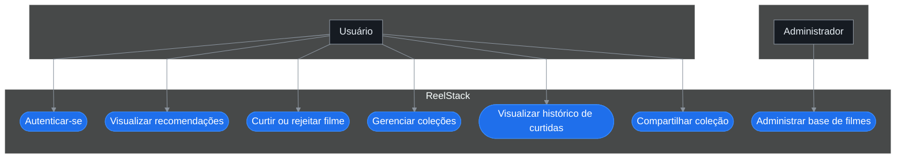
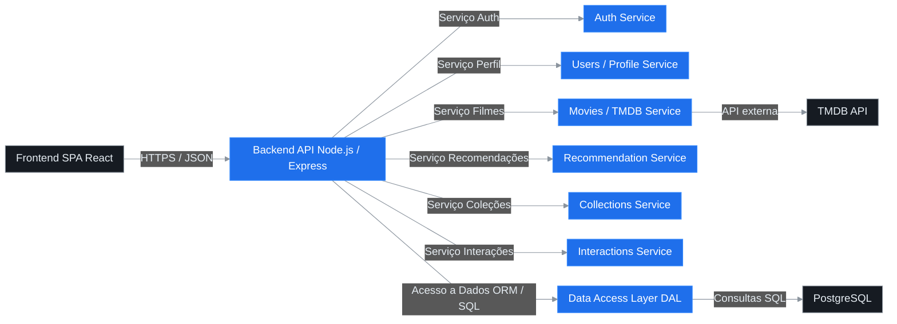
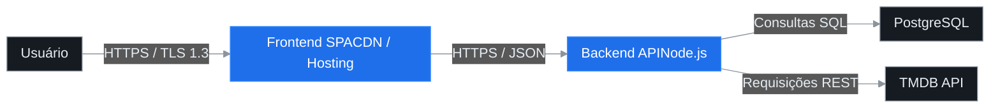
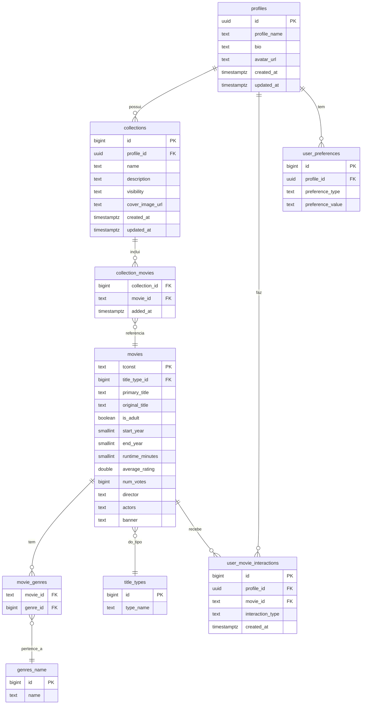
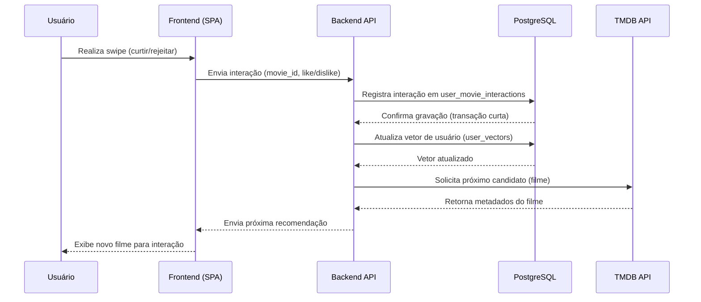
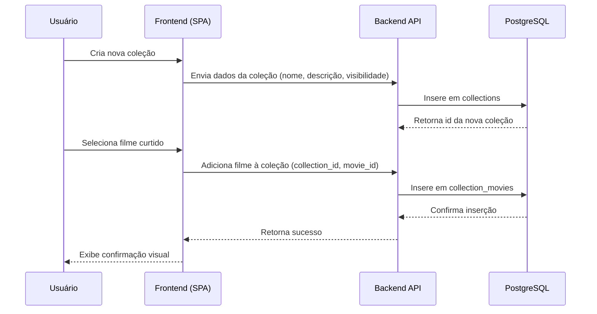
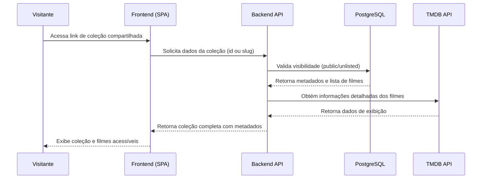

# Documento de Arquitetura de Software — ReelStack

**Versão:** v1.14  
**Data:** 05/11/2025  
**Autores:** Gabriel de Oliveira Batista (Gabs) e Equipe ReelStack  
**Projeto:** ReelStack — Sistema de recomendação e gerenciamento de coleções de filmes  
**Disciplina:** Engenharia de Software / Arquitetura de Software  
**Instituição:** Universidade Católica de Brasília  

---

<p align="center">  
  
</p>

> Este documento descreve a arquitetura do sistema **ReelStack**, incluindo visões lógica, física, de processos, dados, requisitos não funcionais e apêndices técnicos (ADRs, OpenAPI, RLS, migrações SQL).


# Histórico da Revisão

| Data       | Versão | Descrição                                                      | Autor |
|------------|--------|----------------------------------------------------------------|-------|
| 2025-11-03 | v1.0   | Adiciona documentação inicial de arquitetura de software       | Gabs  |
| 2025-11-03 | v1.1   | Atualiza diagramas e detalha arquitetura do ReelStack          | Gabs  |
| 2025-11-03 | v1.2   | Atualiza diagramas C4 para layout centralizado                | Gabs  |
| 2025-11-03 | v1.3   | Simplifica diagramas e aplica tema Mermaid                    | Gabs  |
| 2025-11-04 | v1.4   | Reescreve documentação e adiciona visão de casos de uso       | Gabs  |
| 2025-11-04 | v1.5   | Melhora sintaxe Mermaid e adiciona diagramas principais       | Gabs  |
| 2025-11-04 | v1.6   | Adiciona visão de processos e implantação                     | Gabs  |
| 2025-11-04 | v1.7   | Inclui seções de implementação, desempenho e qualidade        | Gabs  |
| 2025-11-04 | v1.8   | Adiciona índice analítico e histórico de revisão              | Gabs  |
| 2025-11-05 | v1.9   | Incorpora visão de dados (ERD) à documentação principal       | Gabs  |
| 2025-11-05 | v1.10  | Adiciona diagramas de sequência ao apêndice                   | Gabs  |
| 2025-11-05 | v1.11  | Inclui ADRs (decisões arquiteturais)                          | Gabs  |
| 2025-11-05 | v1.12  | Adiciona resumo OpenAPI do MVP                                | Gabs  |
| 2025-11-05 | v1.13  | Adiciona políticas de segurança e exemplos de migração SQL    | Gabs  |
| 2025-11-05 | v1.14  | Refina recomendações e reorganiza seções                      | Gabs  |


# Índice Analítico

- [1. Introdução](#1-introdução)
- [1.1 Finalidade](#11-finalidade)
- [1.2 Escopo](#12-escopo)
- [1.3 Definições, Acrônimos e Abreviações](#13-definições-acrônimos-e-abreviações)
- [1.4 Referências](#14-referências)
- [2. Requisitos e Restrições da Arquitetura](#2-requisitos-e-restrições-da-arquitetura)
- [3. Visão de Casos de Uso](#3-visão-de-casos-de-uso)
- [3.1 Diagrama de Casos de Uso (Visão Geral)](#31-diagrama-de-casos-de-uso-visão-geral)
- [3.2 Mapeamento de Casos de Uso, Regras de Negócio e RNFs](#32-mapeamento-de-casos-de-uso-regras-de-negócio-e-rnfs)
- [4. Visão Lógica](#4-visão-lógica)
- [4.1 Visão Geral](#41-visão-geral)
- [4.2 Pacotes de Design Significativos](#42-pacotes-de-design-significativos)
- [5. Visão de Processos](#5-visão-de-processos)
- [6. Visão de Implantação](#6-visão-de-implantação)
- [6.1 Diagrama de Implantação](#61-diagrama-de-implantação)
- [6.2 Variáveis de Ambiente](#62-variáveis-de-ambiente)
- [6.3 Checklist de Implantação](#63-checklist-de-implantação)
- [7. Visão da Implementação](#7-visão-da-implementação)
- [8. Visão de Dados](#8-visão-de-dados)
- [8.1 Diagrama Entidade-Relacionamento ER](#81-diagrama-entidade-relacionamento-er)
- [8.2 Melhorias Técnicas Recomendadas](#82-melhorias-técnicas-recomendadas)
- [9. Volume e Desempenho](#9-volume-e-desempenho)
- [9.1 Metas do MVP](#91-metas-do-mvp)
- [9.2 Táticas de Desempenho](#92-táticas-de-desempenho)
- [9.3 Validação de Desempenho](#93-validação-de-desempenho)
- [10. Qualidade](#10-qualidade)

# 1. Introdução

## 1.1 Finalidade

Este documento tem como finalidade descrever a arquitetura de software do sistema **ReelStack**, detalhando sua estrutura lógica, componentes, integrações e decisões arquiteturais que sustentam seu funcionamento. O objetivo é assegurar que todos os envolvidos no desenvolvimento, manutenção e evolução do sistema possuam uma visão unificada e tecnicamente fundamentada sobre sua concepção, atendendo aos requisitos funcionais e não funcionais especificados.

## 1.2 Escopo

O **ReelStack** é uma aplicação **web-first** voltada à recomendação personalizada de filmes, permitindo que usuários expressem preferências por meio de interações do tipo *swipe* (like/dislike), formem coleções temáticas e recebam sugestões baseadas em similaridade e histórico de interações.  
O sistema integra-se exclusivamente à API **TMDB (The Movie Database)** para obtenção de metadados de filmes, e utiliza autenticação via e-mail e senha. O backend opera sobre banco de dados **PostgreSQL**, conforme o esquema definido no artefato `schema.sql`. O sistema é protegido por autenticação **JWT**, comunicação segura via **TLS 1.3** e políticas de **Row-Level Security (RLS)** quando aplicável.

## 1.3 Definições, Acrônimos e Abreviações

| Termo | Definição |
|-------|------------|
| **API** | Interface de Programação de Aplicações, utilizada para integração com serviços externos. |
| **JWT** | *JSON Web Token*, padrão para autenticação e autorização baseada em tokens. |
| **TMDB** | *The Movie Database*, serviço externo de metadados de filmes e séries. |
| **RLS** | *Row-Level Security*, política de segurança em nível de linha do PostgreSQL. |
| **ETL** | *Extract, Transform, Load*, processo de extração, transformação e carga de dados. |
| **ReelStack** | Sistema de recomendação e gerenciamento de coleções de filmes desenvolvido neste projeto. |

## 1.4 Referências

- **REQUISITO_SOFTWARE.md** – Documento de requisitos funcionais, não funcionais e regras de negócio do projeto ReelStack.  
- **schema.sql** – Artefato contendo o esquema relacional completo do banco de dados PostgreSQL.  
- **Template_DocumentoArquiteturaSoftware.docx** – Modelo base utilizado para a estruturação deste documento conforme o método RUP/4+1.

# 2. Requisitos e Restrições da Arquitetura

A seguir são apresentados os principais requisitos e restrições arquiteturais do sistema **ReelStack**, definidos a partir dos requisitos funcionais, não funcionais e regras de negócio documentados.

| Categoria | Descrição | Decisão Arquitetural / Restrição |
|------------|------------|----------------------------------|
| **Linguagem / Plataforma** | O sistema deve ser web-first, priorizando compatibilidade com navegadores modernos e dispositivos móveis. | Implementação em **TypeScript/JavaScript (Node.js)** no backend e **React** no frontend. Arquitetura RESTful e comunicação via HTTPS. |
| **Segurança** | O acesso deve ser autenticado e autorizado de forma segura. | Utilização de **JWT (JSON Web Token)** para autenticação, **TLS 1.3** para criptografia de tráfego e **RLS (Row-Level Security)** no PostgreSQL para controle de acesso por perfil. |
| **Persistência** | O sistema deve armazenar dados de usuários, filmes, coleções e interações de forma consistente e rastreável. | Banco de dados **PostgreSQL**, conforme o artefato `schema.sql`. Tabelas normalizadas, chaves primárias compostas e *foreign keys* explícitas. |
| **Internacionalização** | O conteúdo deve ser adaptável a múltiplos idiomas. | MVP restrito ao idioma **português (pt-BR)**. Estrutura preparada para futura integração de i18n no frontend. |
| **Integração Externa (TMDB)** | Os metadados de filmes devem ser obtidos de fonte externa. | Integração exclusiva com a **API TMDB**, utilizando chave de acesso segura e cache local para otimização de requisições. |
| **Desempenho** | O sistema deve manter boa responsividade sob carga moderada. | Meta de **p90 ≤ 1s** de tempo de resposta com **até 100 usuários simultâneos** no MVP. Uso de cache em memória (Redis opcional) e otimização de consultas SQL. |
| **Manutenibilidade / Padronização** | O código deve seguir boas práticas e padrões de desenvolvimento. | Adoção de **ESLint**, **Prettier**, **TypeScript**, *design patterns* RESTful e versionamento semântico. Estrutura modular para facilitar testes e refatorações. |
| **Dependências / Infraestrutura** | A solução deve operar em ambiente escalável e seguro. | Implantação em **nuvem (AWS ou Supabase)**, com **PostgreSQL gerenciado** e suporte a **CI/CD** via GitHub Actions. Dependências gerenciadas por **npm**. |

<div style="text-align: right;">
<em>Tabela 1 – Requisitos e Restrições da Arquitetura do ReelStack</em>
</div>

# 3. Visão de Casos de Uso

O sistema **ReelStack** permite que o usuário autenticado descubra filmes personalizados por meio de interações do tipo *swipe* (curtir ou rejeitar), visualize recomendações com base em seu histórico, gerencie coleções de filmes e compartilhe listas públicas. O administrador possui acesso restrito para fins de manutenção e auditoria de dados. Os principais casos de uso refletem as jornadas essenciais do produto no MVP, priorizando a simplicidade, o desempenho (RNF-002) e a clareza nas mensagens de erro e sucesso (RNF-004).

## 3.1 Diagrama de Casos de Uso (Visão Geral)



## 3.2 Mapeamento de Casos de Uso, Regras de Negócio e RNFs

| Caso de Uso | Regras de Negócio Associadas | RNFs Relevantes |
|--------------|------------------------------|------------------|
| **UC1 – Autenticar-se** | RN-001 (Autenticação via e-mail/senha) | RNF-001 (Segurança com TLS/JWT), RNF-004 (Mensagens claras) |
| **UC2 – Visualizar recomendações** | RN-002 (Geração de recomendações personalizadas), RN-005 (Uso de histórico e preferências) | RNF-002 (Desempenho p90 ≤ 1s), RNF-004 |
| **UC3 – Curtir ou rejeitar filme** | RN-003 (Registro único por interação), RN-004 (Atualização do histórico) | RNF-002, RNF-004 |
| **UC4 – Gerenciar coleções** | RN-006 (CRUD de coleções), RN-007 (Controle de visibilidade pública/privada/não listada) | RNF-003 (Persistência consistente), RNF-004 |
| **UC5 – Visualizar histórico de curtidas** | RN-004 (Histórico atualizado em tempo real) | RNF-002, RNF-004 |
| **UC6 – Compartilhar coleção** | RN-007 (Coleções públicas podem ser compartilhadas) | RNF-001 (Segurança), RNF-004 |
| **UC7 – Administrar base de filmes** | RN-008 (Manutenção e auditoria do catálogo) | RNF-001 (Segurança), RNF-005 (Integridade dos dados) |

<div style="text-align: right;">
<em>Tabela 2 – Mapeamento entre Casos de Uso, Regras de Negócio e RNFs</em>
</div>

# 4. Visão Lógica

## 4.1 Visão Geral

A arquitetura lógica do **ReelStack** é estruturada em camadas independentes e coesas, visando modularidade, segurança e desempenho. O sistema adota uma abordagem **web-first**, com frontend em **SPA (Single Page Application)** comunicando-se via **HTTPS/JSON** com um backend em **API RESTful**, que integra serviços especializados de autenticação, recomendação e persistência. O **PostgreSQL** é utilizado como camada final de armazenamento, garantindo integridade referencial e suporte a políticas de **Row-Level Security (RLS)**.



Cada camada desempenha um papel definido:

- **Frontend SPA**: responsável pela interação com o usuário, fornecendo uma experiência fluida e responsiva. Implementa cache local e chamadas assíncronas para otimizar desempenho (NFR-002).
- **Backend API**: centraliza a lógica de negócios e a integração entre módulos. Utiliza autenticação JWT e HTTPS (TLS 1.3) para comunicação segura (NFR-001), e divide responsabilidades em micro-serviços internos, permitindo escalabilidade horizontal.
- **Camada de Acesso a Dados (DAL)**: encapsula consultas SQL e transações, garantindo integridade e rastreabilidade. Usa índices e *prepared statements* para reduzir latência (NFR-002).
- **Banco PostgreSQL**: provê armazenamento relacional seguro com controle de acesso granular (RLS), assegurando consistência e isolamento de dados.

## 4.2 Pacotes de Design Significativos

| Pacote / Componente | Descrição e Responsabilidades | Decisões de Integridade / Regras de Negócio |
|----------------------|-------------------------------|---------------------------------------------|
| **Auth Controller / Service** | Gerencia autenticação via e-mail/senha, emissão e verificação de JWT. | Garante conformidade com **RN-001**; tokens expiram após tempo definido; falhas autenticadas registradas para auditoria. |
| **Users / Profile Service** | Mantém dados de perfis e preferências; integra RLS para segurança por perfil. | Usa RLS em consultas; evita duplicação de nomes de perfil; segue **RN-006**. |
| **Movies / Metadata Service** | Integra com a API **TMDB** para recuperar metadados de filmes; mantém cache local para reduzir chamadas externas. | Cache TTL de 24h; controle de atualização assíncrona; segue **RN-005**. |
| **Recommendation Service** | Gera recomendações personalizadas com base no histórico e vetores de similaridade. | Baseado em **RN-002**; operações idempotentes; cálculos em batch para desempenho. Utiliza também preferências explícitas (`user_preferences`) para refinar recomendações (**RN-005**) |
| **Interactions Service** | Registra curtidas e rejeições (*like/dislike*) e atualiza vetores de recomendação. | Garante unicidade por filme e perfil (**RN-003**); utiliza transações para atomicidade. |
| **Collections Service** | Criação, atualização, remoção e compartilhamento de coleções de filmes. | Enforce de visibilidade (**RN-007**); controle transacional em exclusões e adições múltiplas. |
| **Error Handling Module** | Padroniza respostas de erro da API, garantindo mensagens claras e consistentes. | Atende **NFR-004** (mensagens compreensíveis e rastreáveis). |
| **Data Access Layer (DAL)** | Implementa abstração para o acesso a dados, isolando consultas SQL e lógica de persistência. | Usa transações ACID; validações de integridade referencial; suporte a rollback em falhas. |

<div style="text-align: right;">
<em>Tabela 3 – Pacotes de Design Significativos do ReelStack</em>
</div>

# 5. Visão de Processos

O **ReelStack** adota um modelo de concorrência baseado em **API stateless**, onde cada requisição é independente e contém suas credenciais de autenticação via **JWT**. As operações críticas sobre o banco de dados utilizam **transações curtas e atômicas**, garantindo integridade sem manter bloqueios prolongados.  
Processos assíncronos são utilizados para **recomputar vetores de recomendação de usuários** com base em novas interações, podendo ocorrer de forma agendada (*batch*) fora do ciclo principal de requisição. Em futuras iterações, poderá ser introduzido um sistema de **filas de mensagens** (ex.: RabbitMQ, Redis Queue) para balancear cargas. No MVP, o processamento assíncrono é simplificado e executado sob demanda pelo backend.

# 6. Visão de Implantação

## 6.1 Diagrama de Implantação



## 6.2 Variáveis de Ambiente

| Variável | Descrição |
|-----------|------------|
| **TMDB_KEY** | Chave de autenticação para integração com a API TMDB. |
| **DB_URL** | URL de conexão segura ao banco de dados PostgreSQL. |
| **JWT_SECRET** | Chave secreta usada para assinatura e verificação de tokens JWT. |

<div style="text-align: right;">
<em>Tabela 4 – Checklist de Implantação do ReelStack</em>
</div>

## 6.3 Checklist de Implantação

1. **Build do Frontend:** gerar versão otimizada da SPA (ex.: `npm run build`) e publicar em hosting/CDN.  
2. **Migração do Banco:** executar scripts de criação (`schema.sql`) e migrações adicionais.  
3. **Aplicar Políticas RLS:** configurar *Row-Level Security* em tabelas com dados de perfil.  
4. **Implantação da API:** iniciar backend configurando variáveis de ambiente e logs seguros.  
5. **Verificação de TLS:** garantir comunicação HTTPS com certificado TLS 1.3 ativo.  
6. **Testes Finais:** validar autenticação, acesso ao banco, integração TMDB e endpoints críticos.  

# 7. Visão da Implementação

A implementação do **ReelStack** segue uma estrutura modular e organizada por contexto de responsabilidade, garantindo manutenibilidade e clareza entre camadas. O projeto é estruturado conforme o padrão monorepo simplificado:

```bash
/apps
├── /frontend      # SPA em React (Next.js ou Vite)
└── /api           # API REST Node.js / Express
/packages
└── /shared        # Tipos TypeScript, DTOs, utilitários e contratos OpenAPI
/infra
├── docker/        # Configuração de containers e banco
├── migrations/    # Scripts SQL de schema e seeds
└── ci-cd/         # Pipelines de build e deploy
```

O contrato entre **frontend** e **backend** será formalizado por meio de **OpenAPI (Swagger)**, assegurando consistência entre clientes e serviços (detalhado no Apêndice).  
As convenções de código incluem:

- **ESLint** e **Prettier** para padronização e formatação automática.  
- Comentários de documentação (`JSDoc` / `TypeDoc`) em funções públicas e APIs.  
- Testes unitários com **Jest**, priorizando funções críticas.  
- Versionamento semântico e *commit linting* para controle evolutivo.  

---

# 8. Visão de Dados

## 8.1 Diagrama Entidade-Relacionamento ER



## 8.2 Melhorias Técnicas Recomendadas

- **Timestamps:** padronizar todas as colunas de data para `timestamptz DEFAULT now()`, garantindo consistência temporal em UTC.  
- **Índices:** criar índices para colunas de chave estrangeira e de filtro frequente (`profile_id`, `movie_id`, `genre_id`, `title_type_id`, `average_rating`, `num_votes`) para otimizar desempenho.  
- **UNIQUE compostas:** aplicar restrições em `(profile_id, movie_id)` em `user_movie_interactions` e `(profile_id, preference_type, preference_value)` em `user_preferences` para prevenir duplicações lógicas.  
- **ON DELETE:** definir políticas adequadas (`CASCADE` ou `SET NULL`) nas FKs derivadas de `profiles` e `collections` para evitar registros órfãos.  
- **Vetores:** planejar migração futura de campos de vetor (usuários e filmes) para o tipo **pgvector**, permitindo consultas vetoriais mais eficientes em recomendações.  

---

# 9. Volume e Desempenho

## 9.1 Metas do MVP

- Suporte a até **100 usuários simultâneos** com respostas médias adequadas.  
- **Tempo de resposta p90 ≤ 1s** para operações de interação (*swipe*, curtir/rejeitar).  

## 9.2 Táticas de Desempenho

- Criação de **índices** sobre colunas-chave (`profile_id`, `movie_id`, `genre_id`).  
- Aplicação de **filtros de candidatos** com base em métricas como `num_votes` e `average_rating`.  
- Envio de **payloads enxutos** em respostas JSON (sem campos não utilizados).  
- Ativação de **compressão HTTP (gzip ou brotli)**.  
- Implementação de **cache leve** para sinopses e metadados de filmes da TMDB.  
- Adoção de **API stateless** e *connection pooling* no banco de dados para escalabilidade.  

## 9.3 Validação de Desempenho

Os testes de carga e desempenho serão conduzidos com **JMeter**, avaliando métricas de latência (p90, p95), throughput e uso de recursos. Logs estruturados e métricas de API (ex.: Prometheus + Grafana) permitirão verificar conformidade com os **Requisitos Não Funcionais (RNF-002)** e **RNF-003** de desempenho e estabilidade.

---

# 10. Qualidade

| Atributo | Descrição | Solução Aplicada |
|-----------|------------|------------------|
| **Escalabilidade** | Capacidade de lidar com aumento gradual de usuários e requisições. | Arquitetura **stateless** com API REST e banco **PostgreSQL gerenciado**; uso de *connection pooling* e possibilidade de horizontalização futura do backend. |
| **Confiabilidade** | Garantia de integridade e consistência das operações. | Uso de **transações ACID**, restrições **UNIQUE** e *foreign keys*; rollback automático em falhas e versionamento controlado de schema. |
| **Disponibilidade** | Manutenção do serviço acessível e responsivo ao usuário. | Hospedagem em ambiente de **nuvem** com monitoramento e *uptime* contínuo; fallback simples em cache local e CDN para frontend. |
| **Portabilidade** | Facilidade de implantação em diferentes infraestruturas. | Implementação em **Node.js** e **React**, dependências padrão e imagens **Docker** multiplataforma; compatibilidade com múltiplos provedores de nuvem. |
| **Segurança** | Proteção de dados, autenticação e controle de acesso. | Comunicação **TLS 1.3**, autenticação **JWT**, e **RLS (Row-Level Security)** no PostgreSQL; políticas de acesso e encriptação de dados sensíveis. |

A arquitetura de qualidade do **ReelStack** assegura conformidade com os **Requisitos Não Funcionais (RNFs)** de desempenho, segurança e disponibilidade, além de reforçar o atendimento das **Regras de Negócio (RNs)** ligadas à integridade dos dados, controle de acesso e consistência das recomendações. Essa base técnica garante estabilidade operacional e suporte sustentável à evolução do sistema.

---

# Apêndice A — Diagramas de Sequência

## A.1 Swipe (curtir/rejeitar)



**Regras aplicáveis:**  
Atende **RN-001** (autenticação segura) e **RN-002** (recomendações personalizadas) com persistência imediata da interação. Cumpre **RNF-002** (desempenho p90 ≤ 1s) e **RNF-004** (mensagens claras e feedback visual).  

---

## A.2 Criar coleção e adicionar filme curtido



**Regras aplicáveis:**  
Baseado em **RN-006** (gerenciamento de coleções) e **RN-007** (visibilidade pública/privada). Garante integridade via transação atômica (**RNF-003**) e mensagens consistentes (**RNF-004**).  

---

## A.3 Acesso público a coleção compartilhada



**Regras aplicáveis:**  
Cumpre **RN-007** (coleções compartilháveis) e **RN-008** (auditoria de acesso). Atende **RNF-001** (segurança via TLS/JWT, mesmo para visitantes limitados) e **RNF-002** (desempenho ao carregar coleções).

---

# Apêndice B — Decisões Arquiteturais (ADRs)

## ADR-001 — Adoção de Banco Relacional PostgreSQL

**Contexto:**  
O sistema ReelStack exige integridade referencial, suporte a transações ACID e flexibilidade para consultas analíticas sobre dados relacionais e históricos. Era necessário um SGBD maduro, compatível com nuvem e com suporte a políticas de segurança em nível de linha (RLS).  
**Decisão:**  
Foi adotado o **PostgreSQL** como banco de dados relacional padrão do sistema. Ele oferece compatibilidade com JSONB, suporte nativo a índices complexos e extensões como **pgvector**, além de ferramentas maduras de replicação e segurança.  
**Consequências:**  

- Benefícios: consistência, confiabilidade e extensibilidade.  
- Risco: necessidade de otimização manual para consultas mais complexas em grande escala.  

---

## ADR-002 — TMDB como Fonte Exclusiva de Metadados no MVP

**Contexto:**  
Durante o MVP, a equipe precisava de uma fonte confiável e gratuita de dados de filmes para alimentar o sistema de recomendações e coleções. Avaliar múltiplas integrações aumentaria o tempo de desenvolvimento.  
**Decisão:**  
Optou-se por utilizar exclusivamente a **API TMDB** para obtenção de metadados (títulos, banners, elenco e notas), reduzindo o esforço de integração e assegurando padronização nos dados exibidos.  
**Consequências:**  

- Benefício: agilidade na entrega do MVP e uniformidade dos dados.  
- Risco: dependência de terceiros e necessidade futura de cache e redundância local.  

---

## ADR-003 — Representação Vetorial em JSONB (Migração futura para pgvector)

**Contexto:**  
Os vetores de similaridade de usuários e filmes são essenciais para o sistema de recomendação, mas a extensão **pgvector** não é nativa em todos os ambientes de nuvem.  
**Decisão:**  
Optou-se por armazenar vetores em formato **JSONB** no MVP, garantindo compatibilidade imediata e portabilidade. A migração para **pgvector** está planejada para a próxima versão, visando melhorar o desempenho em consultas de similaridade.  
**Consequências:**  

- Benefício: facilidade de implantação inicial e compatibilidade universal.  
- Risco: menor eficiência em operações vetoriais até a migração definitiva.  

---

## ADR-004 — Arquitetura Web-First (SPA + REST)

**Contexto:**  
A aplicação visa usuários em múltiplas plataformas (desktop e mobile). O foco do MVP é a fluidez e responsividade da interface, com baixo acoplamento entre frontend e backend.  
**Decisão:**  
Adotou-se uma arquitetura **web-first** com **Single Page Application (React)** comunicando-se via **API RESTful (Node.js/Express)**. Essa separação permite desenvolvimento paralelo e escalabilidade futura por microsserviços.  
**Consequências:**  

- Benefício: flexibilidade, reuso e independência tecnológica.  
- Risco: maior complexidade inicial em autenticação e CORS.  

---

## ADR-005 — Segurança com TLS 1.3, JWT e RLS

**Contexto:**  
O sistema lida com dados pessoais e deve garantir confidencialidade, autenticação segura e controle granular de acesso a registros.  
**Decisão:**  
Implementar **TLS 1.3** para criptografia de tráfego, **JWT** para autenticação stateless e **Row-Level Security (RLS)** no PostgreSQL para isolar dados por usuário.  
**Consequências:**  

- Benefício: conformidade com boas práticas de segurança e proteção por múltiplas camadas.  
- Risco: sobrecarga mínima de configuração e necessidade de rotação periódica de chaves JWT.  

---

## ADR-006 — Padronização de Mensagens e Tratamento Centralizado de Erros

**Contexto:**  
Mensagens inconsistentes prejudicam a experiência do usuário e dificultam o rastreio de falhas.  
**Decisão:**  
Centralizar o tratamento de exceções no backend, com respostas padronizadas em JSON, seguindo um formato unificado (`error.code`, `message`, `details`).  
**Consequências:**  

- Benefício: consistência nas respostas e melhor rastreabilidade.  
- Risco: dependência da manutenção de um middleware unificado.  

---

## ADR-007 — Timezone e Timestamps com `timestamptz DEFAULT now()`

**Contexto:**  
O sistema envolve usuários em diferentes fusos e eventos registrados por hora. É essencial padronizar o registro temporal para evitar discrepâncias.  
**Decisão:**  
Adotar o tipo **timestamptz DEFAULT now()** em todas as tabelas, armazenando horários em UTC e mantendo consistência em logs e auditorias.  
**Consequências:**  

- Benefício: coerência temporal entre ambientes e simplicidade em auditoria.  
- Risco: necessidade de conversão no frontend para exibição no fuso horário do usuário.

---

# Apêndice C — OpenAPI (Resumo do MVP)

```yaml
openapi: 3.1.0
info:
 title: ReelStack API (MVP)
 version: 1.0.0
 description: API RESTful para autenticação, recomendações, interações e coleções de filmes.
servers:
 - url: https://api.reelstack.app/v1
components:
 securitySchemes:
   bearerAuth:
     type: http
     scheme: bearer
     bearerFormat: JWT
 schemas:
   Recommendation:
     type: object
     properties:
       movie_id:
         type: string
       title:
         type: string
       banner:
         type: string
       average_rating:
         type: number
       num_votes:
         type: integer
   Interaction:
     type: object
     properties:
       movie_id:
         type: string
       interaction_type:
         type: string
         enum: [like, dislike]
     required: [movie_id, interaction_type]
security:
 - bearerAuth: []
paths:
 /auth/signup:
   post:
     summary: Cria novo usuário.
     requestBody:
       required: true
       content:
         application/json:
           schema:
             type: object
             properties:
               email: { type: string }
               password: { type: string }
     responses:
       "201": { description: Usuário criado }
       "400": { description: Dados inválidos }
 /auth/login:
   post:
     summary: Autentica usuário e retorna token JWT.
     responses:
       "200": { description: Token JWT emitido }
 /me:
   get:
     summary: Retorna perfil autenticado.
     security: [{ bearerAuth: [] }]
     responses:
       "200": { description: Perfil do usuário }
 /recommendations:
   get:
     summary: Retorna lista de recomendações personalizadas.
     security: [{ bearerAuth: [] }]
     parameters:
       - name: limit
         in: query
         schema: { type: integer, default: 10 }
     responses:
       "200":
         description: Lista de recomendações
         content:
           application/json:
             schema:
               type: array
               items: { $ref: "#/components/schemas/Recommendation" }
 /interactions:
   post:
     summary: Registra interação (curtir/rejeitar).
     security: [{ bearerAuth: [] }]
     requestBody:
       required: true
       content:
         application/json:
           schema: { $ref: "#/components/schemas/Interaction" }
     responses:
       "201": { description: Interação registrada }
 /collections:
   get:
     summary: Lista coleções do usuário autenticado.
     security: [{ bearerAuth: [] }]
     responses:
       "200": { description: Lista de coleções }
   post:
     summary: Cria nova coleção.
     security: [{ bearerAuth: [] }]
     responses:
       "201": { description: Coleção criada }
 /collections/{id}:
   put:
     summary: Atualiza coleção existente.
     security: [{ bearerAuth: [] }]
     responses:
       "200": { description: Coleção atualizada }
   delete:
     summary: Remove coleção.
     security: [{ bearerAuth: [] }]
     responses:
       "204": { description: Removida com sucesso }
 /collections/{id}/items:
   post:
     summary: Adiciona filme à coleção.
     security: [{ bearerAuth: [] }]
     responses:
       "201": { description: Item adicionado }
   delete:
     summary: Remove filme da coleção.
     security: [{ bearerAuth: [] }]
     responses:
       "204": { description: Item removido }
 /public/collections/{slug}:
   get:
     summary: Acessa coleção compartilhada (pública ou não listada).
     responses:
       "200": { description: Coleção acessível publicamente }
```

## Regras de Paginação e Filtros

• Parâmetro limit: define o número máximo de itens retornados por requisição (padrão 10, máximo 50).
• Filtros de recomendação priorizam filmes com **num_votes ≥ 100 e average_rating ≥ 5.0.**
• Requisições subsequentes podem incluir offset para navegação paginada.

## Padrão de Erros da API

• Respostas de erro seguem o formato JSON:

```json
{
  "error": {
    "code": "BAD_REQUEST",
    "message": "Parâmetros inválidos.",
    "details": {}
  }
}
```

### Códigos comuns

• **400** – Requisição inválida (dados incorretos)
• **401** – Não autorizado (token ausente ou inválido)
• **403** – Acesso negado
• **404** – Recurso não encontrado
• **500** – Erro interno no servidor

---

# Apêndice D — Segurança (RLS) e Migrações SQL

## D.1 Políticas de Segurança (Row-Level Security)


```sql
-- Ativação do Row-Level Security (RLS) nas tabelas sensíveis  
ALTER TABLE public.collections ENABLE ROW LEVEL SECURITY;
ALTER TABLE public.user_movie_interactions ENABLE ROW LEVEL SECURITY;
ALTER TABLE public.user_preferences ENABLE ROW LEVEL SECURITY;
ALTER TABLE public.user_vectors ENABLE ROW LEVEL SECURITY;
-- Política: o dono do registro pode ler e escrever  
```

```sql
CREATE POLICY collections_owner_rw
   ON public.collections
   USING (auth.uid() = profile_id)
   WITH CHECK (auth.uid() = profile_id);
CREATE POLICY interactions_owner_rw
   ON public.user_movie_interactions
   USING (auth.uid() = profile_id)
   WITH CHECK (auth.uid() = profile_id);
CREATE POLICY preferences_owner_rw
   ON public.user_preferences
   USING (auth.uid() = profile_id)
   WITH CHECK (auth.uid() = profile_id);
CREATE POLICY user_vectors_owner_rw
   ON public.user_vectors
   USING (auth.uid() = profile_id)
   WITH CHECK (auth.uid() = profile_id);
CREATE POLICY collections_public_read
   ON public.collections
   FOR SELECT
   USING (
       visibility IN ('public', 'unlisted')
       OR auth.uid() = profile_id
   )
```

---

## D.2 Migrações de Higiene e Performance

-- Padronização de timestamps para `timestamptz DEFAULT now()`  

```sql
ALTER TABLE public.profiles ALTER COLUMN created_at SET DEFAULT now();
ALTER TABLE public.profiles ALTER COLUMN updated_at SET DEFAULT now();
ALTER TABLE public.collections ALTER COLUMN created_at SET DEFAULT now();
ALTER TABLE public.collections ALTER COLUMN updated_at SET DEFAULT now();
ALTER TABLE public.collection_movies ALTER COLUMN added_at SET DEFAULT now();
ALTER TABLE public.user_movie_interactions ALTER COLUMN created_at SET DEFAULT now();
-- Restrições UNIQUE compostas  

ALTER TABLE public.user_movie_interactions
   ADD CONSTRAINT uq_user_movie UNIQUE (profile_id, movie_id);
ALTER TABLE public.user_preferences
   ADD CONSTRAINT uq_user_preferences UNIQUE (profile_id, preference_type, preference_value);
-- Índices de FKs e colunas de filtro  

CREATE INDEX idx_collections_profile ON public.collections (profile_id);
CREATE INDEX idx_collection_movies_collection ON public.collection_movies (collection_id);
CREATE INDEX idx_collection_movies_movie ON public.collection_movies (movie_id);
CREATE INDEX idx_movie_genres_movie ON public.movie_genres (movie_id);
CREATE INDEX idx_movie_genres_genre ON public.movie_genres (genre_id);
CREATE INDEX idx_user_interactions_profile ON public.user_movie_interactions (profile_id);
CREATE INDEX idx_user_interactions_movie ON public.user_movie_interactions (movie_id);
CREATE INDEX idx_movies_rating_votes ON public.movies (average_rating, num_votes);
-- Regras de exclusão em cascata (integridade de junções)  

ALTER TABLE public.collection_movies
   DROP CONSTRAINT IF EXISTS collection_movies_collection_id_fkey,
   ADD CONSTRAINT collection_movies_collection_id_fkey
   FOREIGN KEY (collection_id) REFERENCES public.collections(id)
   ON DELETE CASCADE;
ALTER TABLE public.collection_movies
   DROP CONSTRAINT IF EXISTS collection_movies_movie_id_fkey,
   ADD CONSTRAINT collection_movies_movie_id_fkey
   FOREIGN KEY (movie_id) REFERENCES public.movies(tconst)
   ON DELETE CASCADE;
ALTER TABLE public.movie_genres
   DROP CONSTRAINT IF EXISTS movie_genres_movie_id_fkey,
   ADD CONSTRAINT movie_genres_movie_id_fkey
   FOREIGN KEY (movie_id) REFERENCES public.movies(tconst)
   ON DELETE CASCADE
```
