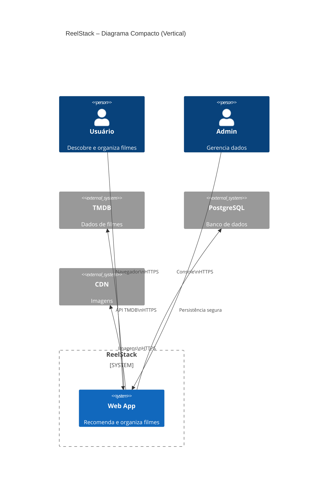
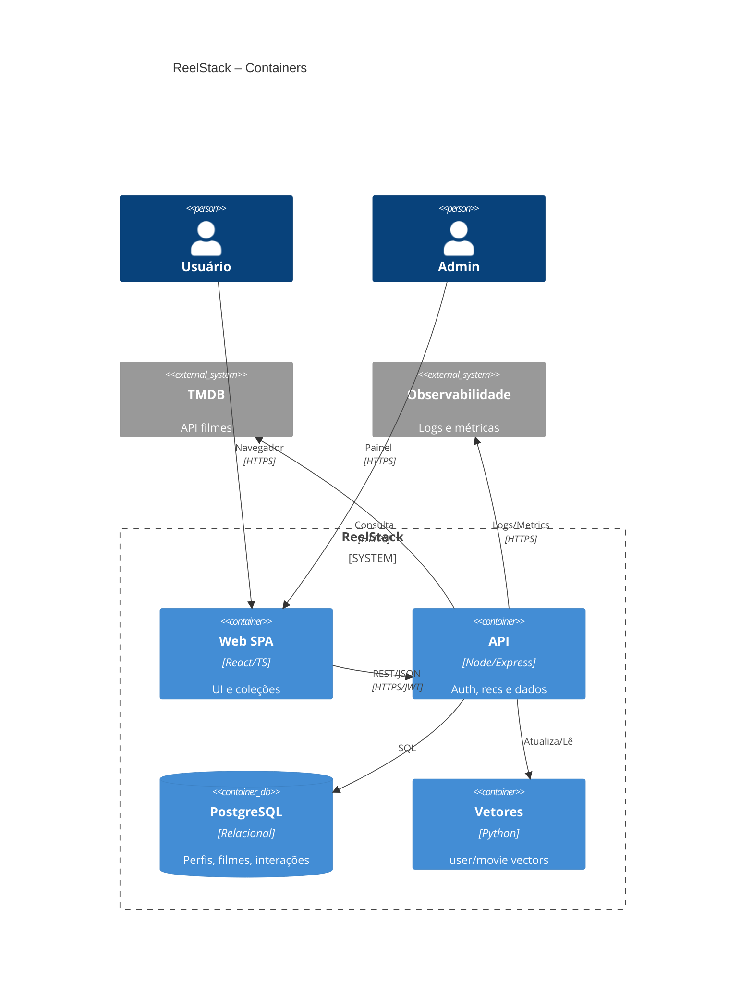

### Descrição do Contexto e Limites

O **ReelStack** é um sistema **web-first** que centraliza as funcionalidades de descoberta, recomendação e organização de filmes, fornecendo uma experiência de uso fluida baseada em gestos de swipe. Ele atua como intermediário entre o **usuário final**, que realiza interações como curtir, rejeitar e criar coleções, e as fontes externas de dados e mídia — notadamente a **API do TMDB**, utilizada como fonte exclusiva de metadados conforme a RN-005, e uma **CDN de imagens**, responsável pela entrega rápida de recursos visuais. Todas as interações entre navegador e sistema ocorrem via **HTTPS/TLS 1.3**, garantindo a proteção dos dados em trânsito e atendendo ao requisito não funcional de **segurança**.

O **Administrador** acessa o sistema por meio de um painel protegido, dedicado à gestão de dados internos, auditoria de logs e resolução de falhas operacionais, mantendo o controle de integridade e conformidade do sistema. O **Banco de Dados PostgreSQL** concentra o armazenamento de informações críticas — perfis, coleções, interações e vetores de recomendação — sustentando as operações do back-end e garantindo consistência relacional.

Essa arquitetura de contexto reforça os **NFRs de desempenho e segurança**, ao delimitar claramente as fronteiras de comunicação segura (TLS 1.3) e ao delegar tarefas de latência crítica — como o carregamento de imagens — para componentes otimizados (CDN). Além disso, o uso de uma API consolidada (TMDB) e o isolamento entre camadas de aplicação e dados favorecem o controle de tempo de resposta (swipe ≤1s p90 com 100 usuários) e a escalabilidade do MVP.

### Justificativa Arquitetural

A arquitetura em **nível de containers** do ReelStack foi projetada para garantir **segurança, baixa latência** e **escalabilidade horizontal**, preservando a simplicidade de um MVP web-first. O **Frontend Web (SPA)**, desenvolvido em React/TypeScript, oferece uma experiência contínua e responsiva, minimizando recarregamentos de página e permitindo que interações de swipe ocorram em menos de 1 segundo (p90) graças à renderização local e cache leve de requisições. O **Backend API REST**, implementado em Node.js/Express, é responsável por autenticação, persistência e lógica de negócio, comunicando-se exclusivamente via **HTTPS/TLS 1.3** e utilizando **JSON** como formato padrão de troca de dados.

O **PostgreSQL** centraliza o armazenamento transacional (coleções, filmes, gêneros, interações), além dos **vetores de recomendação** (user_vectors e movie_vectors), garantindo consistência e integridade das informações. O **Serviço de Vetores**, modular e interno, realiza a manutenção dos dados de similaridade, otimizando as recomendações sem sobrecarregar o fluxo principal de requisições do usuário. Esse desacoplamento permite que o swipe responda rapidamente, mesmo durante cálculos de recomendação em segundo plano.

A comunicação com a **API do TMDB** ocorre de forma segura e assíncrona, assegurando conformidade com a RN-005 e reduzindo latência com caching e pré-carregamento seletivo. A camada de **observabilidade** coleta logs e métricas de latência (via Prometheus, Grafana ou ELK), permitindo monitorar tempos de resposta e detecção proativa de falhas. O uso consistente de TLS 1.3 em todas as conexões externas e a autenticação via **JWT** garantem a confidencialidade e integridade dos dados, atendendo diretamente aos NFRs de **desempenho** (swipe ≤1s p90) e **segurança**.
 