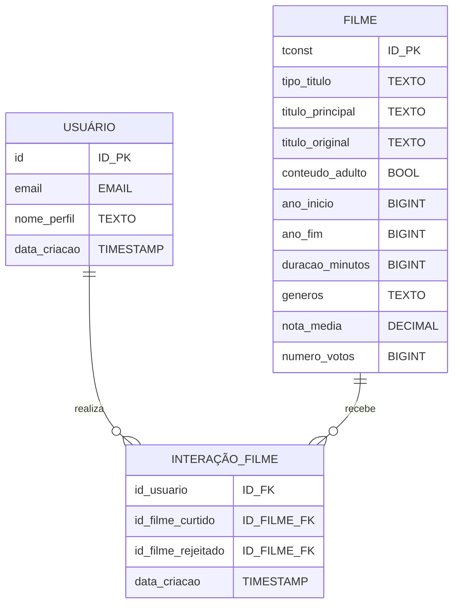

# Documentação do Banco de Dados

## Glossário Técnico das Tabelas

### Tabela Titulos

| Coluna | Descrição | Tipo de Dado | Formato | Pode ser Nulo? |
|--------|-----------|--------------|---------|----------------|
| tconst | Identificador único do título no IMDb, usado para referência cruzada e integração com outras bases de dados. | string | tt1234567 | Não |
| titleType | Categoria do conteúdo, como filme, curta-metragem, série de TV, documentário, etc. | string | texto | Não |
| primaryTitle | Nome principal pelo qual o título é conhecido publicamente. | string | texto | Não |
| originalTitle | Nome original do título, geralmente no idioma de produção. | string | texto | Não |
| isAdult | Indicador booleano (true ou false) que mostra se o conteúdo é voltado para o público adulto. | booleano | true ou false | Não |
| startYear | Ano de lançamento ou início da exibição do título. | inteiro | AAAA | Sim |
| endYear | Ano de encerramento da exibição (aplicável principalmente para séries). | inteiro | AAAA | Sim |
| runtimeMinutes | Duração total do título em minutos. | inteiro | número inteiro | Sim |
| genres | Lista de gêneros associados ao título, como ação, comédia, drama, etc. | string | texto separado por vírgulas | Sim |
| averageRating | Nota média atribuída pelos usuários do IMDb. | float | 0.0 a 10.0 | Sim |
| numVotes | Quantidade total de votos recebidos para cálculo da nota média. | inteiro | número inteiro | Sim |

### Tabela Usuários

| Coluna | Descrição | Tipo de Dado | Formato | Pode ser Nulo? |
|--------|-----------|--------------|---------|----------------|
| id | Identificador único do usuário no sistema. Usado para referência interna e operações de banco de dados. | inteiro | número inteiro | Não |
| created_at | Data e hora em que o registro do usuário foi criado, incluindo o fuso horário. | timestamp | AAAA-MM-DD HH:MM:SS±TZ | Não |
| email | Endereço de e-mail associado ao usuário, utilizado para autenticação e comunicação. | string | email | Não |
| profile_name | Nome público do perfil do usuário, exibido em interfaces e interações sociais. | string | texto | Sim |

### Tabela Interações

| Coluna | Descrição | Tipo de Dado | Formato | Pode ser Nulo? |
|--------|-----------|--------------|---------|----------------|
| id_user | Identificador único do usuário que realizou a ação (curtir ou não curtir um filme). | inteiro | número inteiro | Não |
| id_movie_liked | Identificador do filme que o usuário marcou como curtido. Pode estar ausente se a ação foi apenas de 'não curtir'. | string | tt1234567 | Sim |
| created_at | Data e hora em que a interação foi registrada no sistema, incluindo o fuso horário. | timestamp | AAAA-MM-DD HH:MM:SS±TZ | Não |
| id_movie_disliked | Identificador do filme que o usuário marcou como não curtido. Pode estar ausente se a ação foi apenas de 'curtir'. | string | tt1234567 | Sim |

---

## 1. Modelo Conceitual (Diagrama Entidade-Relacionamento)



---

## 2. Modelo Lógico

### USUÁRIO
| Campo | Tipo | Restrição |
|-------|------|-----------|
| id | BIGINT | PK, IDENTITY |
| email | VARCHAR | UNIQUE, NOT NULL |
| nome_perfil | TEXT | UNIQUE, NOT NULL |
| data_criacao | TIMESTAMP | NOT NULL |

### FILME
| Campo | Tipo | Restrição |
|-------|------|-----------|
| tconst | TEXT | PK |
| tipo_titulo | TEXT | |
| titulo_principal | TEXT | |
| titulo_original | TEXT | |
| conteudo_adulto | BOOLEAN | |
| ano_inicio | BIGINT | |
| ano_fim | BIGINT | |
| duracao_minutos | BIGINT | |
| generos | TEXT | |
| nota_media | DOUBLE PRECISION | |
| numero_votos | BIGINT | |

### INTERAÇÃO_FILME
| Campo | Tipo | Restrição |
|-------|------|-----------|
| id | BIGINT | PK, IDENTITY |
| id_usuario | BIGINT | FK |
| id_filme_curtido | TEXT | FK |
| id_filme_rejeitado | TEXT | FK |
| data_criacao | TIMESTAMP | NOT NULL |

---

## 3. Modelo Físico (Script SQL)

```sql
-- Criação das tabelas
-- WARNING: This schema is for context only and is not meant to be run.
-- Table order and constraints may not be valid for execution.

CREATE TABLE movies (
  tconst text NOT NULL,
  titleType text,
  primaryTitle text,
  originalTitle text,
  isAdult boolean,
  startYear bigint,
  endYear bigint,
  runtimeMinutes bigint,
  genres text,
  averageRating double precision,
  numVotes bigint,
  CONSTRAINT movies_pkey PRIMARY KEY (tconst)
);

CREATE TABLE users (
  id bigint GENERATED ALWAYS AS IDENTITY NOT NULL,
  created_at timestamp with time zone NOT NULL DEFAULT now(),
  email character varying NOT NULL UNIQUE,
  profile_name text NOT NULL DEFAULT ''::text UNIQUE,
  CONSTRAINT users_pkey PRIMARY KEY (id)
);

CREATE TABLE users_movies (
  id bigint GENERATED ALWAYS AS IDENTITY NOT NULL,
  id_movie_liked text,
  created_at timestamp with time zone NOT NULL DEFAULT now(),
  id_movie_disliked text,
  id_user bigint NOT NULL,
  CONSTRAINT users_movies_pkey PRIMARY KEY (id),
  CONSTRAINT users_profile_id_movie_fkey FOREIGN KEY (id_movie_liked) REFERENCES movies(tconst),
  CONSTRAINT users_movies_id_movie_disliked_fkey FOREIGN KEY (id_movie_disliked) REFERENCES movies(tconst),
  CONSTRAINT users_movies_id_user_fkey FOREIGN KEY (id_user) REFERENCES users(id),
  CONSTRAINT users_movies_like_dislike_check CHECK (
    (id_movie_liked IS NOT NULL AND id_movie_disliked IS NULL)
    OR
    (id_movie_liked IS NULL AND id_movie_disliked IS NOT NULL)
  )
);
```
---
## 1. Requisitos Funcionais
Os requisitos abaixo descrevem as principais funcionalidades do sistema que envolvem operações com o banco de dados:

- **Cadastro de usuários**
  - Inserção de dados na tabela de usuários
  - Validação de dados únicos (email, nome_perfil)

- **Interações com filmes**
  - Registro de curtidas/descurtidas 
  - Armazenamento do histórico de interações

- **Busca e filtros**
  - Busca de filmes por gênero
  - Filtros por avaliação
  - Controle de conteúdo adulto

---

## 2. Modelo de Dados

### 2.1 Estrutura
- Diagrama Entidade-Relacionamento (DER)
- Modelo Relacional
- Dicionário de dados das tabelas
- Mapeamento dos relacionamentos

### 2.2 Relacionamentos
- Usuário → Interações (1:N)
- Filme → Interações (1:N)

---

## 3. Requisitos Não Funcionais

### 3.1 Performance
- Tempo de resposta das consultas
- Otimização de índices
- Cache de consultas frequentes

### 3.2 Segurança
- Criptografia de dados sensíveis
- Controle de acesso
- Proteção contra injeção SQL

### 3.3 Escalabilidade
- Capacidade de crescimento
- Particionamento de dados
- Balanceamento de carga

### 3.4 Backup e Recuperação
- Políticas de backup
- Procedimentos de recuperação
- Retenção de dados

---

## 4. Regras de Negócio

### 4.1 Interações
- Um usuário não pode curtir e descurtir o mesmo filme simultaneamente
- Todas as interações devem ser registradas com timestamp

### 4.2 Conteúdo
- Filmes adultos têm acesso restrito
- Classificação etária deve ser respeitada

---

## 5. Requisitos de Integração

### 5.1 APIs Externas
- Integração com IMDb
- Sincronização periódica
- Tratamento de inconsistências

### 5.2 Formato dos Dados
- Padronização de dados importados
- Mapeamento de campos externos
- Validação de integridade