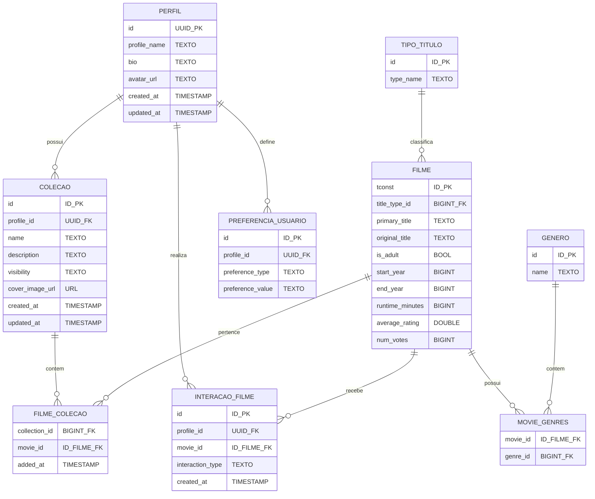

# **Documentação do Banco de Dados**

#  Glossário Técnico das Tabelas
---
###  **Tabela Perfis (`profiles`)**
| Coluna        | Descrição                                                                 | Tipo de Dado | Formato                | Pode ser Nulo? |
| -------------- | ------------------------------------------------------------------------- | ------------- | ---------------------- | -------------- |
| id             | Identificador único do perfil, vinculado ao usuário autenticado.          | uuid          | UUID v4                | Não            |
| created_at     | Data e hora de criação do perfil, considerando o fuso horário UTC.        | timestamp     | AAAA-MM-DD HH:MM:SS±TZ | Não            |
| bio            | Texto opcional com a biografia do usuário.                                | string        | texto livre            | Sim            |
| updated_at     | Data e hora da última atualização do perfil.                              | timestamp     | AAAA-MM-DD HH:MM:SS±TZ | Não            |
| avatar_url     | Endereço de imagem utilizado como avatar do perfil.                       | string        | URL                    | Sim            |
| profile_name   | Nome público do perfil, exibido nas interações sociais e coleções.        | string        | texto                  | Não            |
---
###  **Tabela Tipos de Título (`title_types`)**
| Coluna    | Descrição                                                 | Tipo de Dado | Formato | Pode ser Nulo? |
| ---------- | --------------------------------------------------------- | ------------- | ------- | -------------- |
| id         | Identificador único do tipo de título.                   | inteiro       | número inteiro | Não |
| type_name  | Nome do tipo de título (ex: movie, short, tvSeries).     | string        | texto   | Não |
---
###  **Tabela Gêneros (`genres`)**
| Coluna | Descrição                            | Tipo de Dado | Formato | Pode ser Nulo? |
| ------- | ------------------------------------ | ------------- | ------- | -------------- |
| id      | Identificador único do gênero.       | inteiro       | número inteiro | Não |
| name    | Nome do gênero (ex: Action, Drama).  | string        | texto   | Não |
---
###  **Tabela Filmes (`movies`)**
| Coluna          | Descrição                                                        | Tipo de Dado | Formato        | Pode ser Nulo? |
| ---------------- | ---------------------------------------------------------------- | ------------- | --------------- | -------------- |
| tconst           | Identificador único do título, proveniente do IMDb.              | string        | tt1234567       | Não            |
| title_type_id    | Chave estrangeira para o tipo de título.                         | inteiro       | número inteiro  | Sim            |
| primary_title    | Nome principal pelo qual o título é conhecido.                   | string        | texto           | Sim            |
| original_title   | Nome original no idioma de produção.                             | string        | texto           | Sim            |
| is_adult         | Indica se o conteúdo é voltado para o público adulto.            | booleano      | true/false      | Sim            |
| start_year       | Ano de lançamento ou início de exibição.                         | inteiro       | AAAA            | Sim            |
| end_year         | Ano de encerramento da exibição (para séries).                   | inteiro       | AAAA            | Sim            |
| runtime_minutes  | Duração total do conteúdo em minutos.                            | inteiro       | número inteiro  | Sim            |
| average_rating   | Nota média dos usuários no IMDb.                                 | float         | 0.0 a 10.0      | Sim            |
| num_votes        | Quantidade total de votos recebidos.                             | inteiro       | número inteiro  | Sim            |
---
###  **Tabela Gêneros por Filme (`movie_genres`)**
| Coluna    | Descrição                                         | Tipo de Dado | Formato       | Pode ser Nulo? |
| ---------- | ------------------------------------------------- | ------------- | -------------- | -------------- |
| movie_id   | Identificador do filme associado (FK → movies).  | string        | tt1234567      | Não            |
| genre_id   | Identificador do gênero associado (FK → genres). | inteiro       | número inteiro | Não            |
---
###  **Tabela Coleções (`collections`)**
| Coluna          | Descrição                                                      | Tipo de Dado | Formato                | Pode ser Nulo? |
| ---------------- | -------------------------------------------------------------- | ------------- | ---------------------- | -------------- |
| id               | Identificador único da coleção.                                | inteiro       | número inteiro         | Não            |
| profile_id       | Identificador do perfil proprietário da coleção.               | uuid          | UUID v4                | Não            |
| name             | Nome da coleção (ex: “Favoritos”, “Assistir mais tarde”).      | string        | texto                  | Não            |
| description      | Texto descritivo da coleção.                                   | string        | texto                  | Sim            |
| created_at       | Data e hora da criação da coleção.                             | timestamp     | AAAA-MM-DD HH:MM:SS±TZ | Não            |
| updated_at       | Data e hora da última atualização.                             | timestamp     | AAAA-MM-DD HH:MM:SS±TZ | Não            |
| visibility       | Define o nível de visibilidade (public, private, unlisted).    | string        | texto                  | Sim            |
| cover_image_url  | Endereço da imagem de capa da coleção.                         | string        | URL                    | Sim            |
---
###  **Tabela Filmes em Coleções (`collection_movies`)**
| Coluna        | Descrição                                                 | Tipo de Dado | Formato                | Pode ser Nulo? |
| -------------- | --------------------------------------------------------- | ------------- | ---------------------- | -------------- |
| collection_id  | Identificador da coleção que contém o filme.              | inteiro       | número inteiro         | Não            |
| movie_id       | Identificador do filme associado à coleção.               | string        | tt1234567              | Não            |
| added_at       | Data e hora em que o filme foi adicionado à coleção.      | timestamp     | AAAA-MM-DD HH:MM:SS±TZ | Não            |
---
###  **Tabela Interações de Usuário com Filmes (`user_movie_interactions`)**
| Coluna           | Descrição                                         | Tipo de Dado | Formato                | Pode ser Nulo? |
| ---------------- | ------------------------------------------------- | ------------- | ---------------------- | -------------- |
| id               | Identificador único da interação.                 | inteiro       | número inteiro         | Não            |
| profile_id       | Identificador do perfil que realizou a interação. | uuid          | UUID v4                | Não            |
| movie_id         | Identificador do filme com o qual interagiu.      | string        | tt1234567              | Não            |
| interaction_type | Tipo de interação: 'like' ou 'dislike'.           | string        | texto                  | Não            |
| created_at       | Data e hora da interação (UTC).                   | timestamp     | AAAA-MM-DD HH:MM:SS±TZ | Não            |
---
###  **Tabela Preferências de Usuário (`user_preferences`)**
| Coluna           | Descrição                                             | Tipo de Dado | Formato       | Pode ser Nulo? |
| ---------------- | ----------------------------------------------------- | ------------- | -------------- | -------------- |
| id               | Identificador único da preferência.                   | inteiro       | número inteiro | Não            |
| profile_id       | Identificador do perfil associado à preferência.      | uuid          | UUID v4        | Não            |
| preference_type  | Tipo da preferência (genre, actor, director, decade). | string        | texto          | Não            |
| preference_value | Valor da preferência (ex: “Action”, “Brad Pitt”).    | string        | texto          | Não            |
---
###  **Resumo das Relações entre Tabelas**
| Relação                                         | Tipo                                            |
| ----------------------------------------------- | ----------------------------------------------- |
| **profiles** 1 → N **collections**              | Um perfil pode ter várias coleções.             |
| **collections** 1 → N **collection_movies**      | Cada coleção contém vários filmes.              |
| **movies** 1 → N **collection_movies**           | Um filme pode estar em várias coleções.         |
| **profiles** 1 → N **user_movie_interactions**   | Um perfil pode interagir com vários filmes.     |
| **movies** 1 → N **user_movie_interactions**     | Um filme pode receber várias interações.        |
| **profiles** 1 → N **user_preferences**          | Um perfil pode ter várias preferências.         |
| **title_types** 1 → N **movies**                 | Cada tipo de título pode estar associado a vários filmes. |
| **genres** N → N **movies**                     | Relacionamento feito via `movie_genres`.        |

---

## 1. Modelo Conceitual (Diagrama Entidade-Relacionamento)



---

## **2. Modelo Lógico**

### **PERFIL**

| Campo            | Tipo      | Restrição                          |
| ---------------- | --------- | ---------------------------------- |
| id               | UUID      | PK, DEFAULT `auth.uid()`           |
| nome_perfil      | TEXT      | UNIQUE, NOT NULL                   |
| bio              | TEXT      |                                    |
| avatar_url       | TEXT      |                                    |
| data_criacao     | TIMESTAMP | DEFAULT `now() AT TIME ZONE 'utc'` |
| data_atualizacao | TIMESTAMP | DEFAULT `now() AT TIME ZONE 'utc'` |
| fk_auth_user     | UUID      | FK → `auth.users(id)`              |

---

### **COLEÇÃO**

| Campo            | Tipo      | Restrição                                                         |
| ---------------- | --------- | ----------------------------------------------------------------- |
| id               | BIGINT    | PK, IDENTITY                                                      |
| id_perfil        | UUID      | FK → `profiles(id)`                                               |
| nome             | TEXT      | NOT NULL                                                          |
| descricao        | TEXT      |                                                                   |
| visibilidade     | TEXT      | CHECK (`'public'`, `'private'`, `'unlisted'`), DEFAULT `'public'` |
| imagem_capa      | TEXT      |                                                                   |
| data_criacao     | TIMESTAMP | DEFAULT `now() AT TIME ZONE 'utc'`                                |
| data_atualizacao | TIMESTAMP | DEFAULT `now() AT TIME ZONE 'utc'`                                |

---

### **FILME**

| Campo            | Tipo             | Restrição |
| ---------------- | ---------------- | --------- |
| tconst           | TEXT             | PK        |
| tipo_titulo      | TEXT             |           |
| titulo_principal | TEXT             |           |
| titulo_original  | TEXT             |           |
| conteudo_adulto  | BOOLEAN          |           |
| ano_inicio       | BIGINT           |           |
| ano_fim          | BIGINT           |           |
| duracao_minutos  | BIGINT           |           |
| generos          | TEXT             |           |
| nota_media       | DOUBLE PRECISION |           |
| numero_votos     | BIGINT           |           |

---

### **FILME_COLEÇÃO**

| Campo       | Tipo      | Restrição                          |
| ----------- | --------- | ---------------------------------- |
| id_colecao  | BIGINT    | PK, FK → `collections(id)`         |
| id_filme    | TEXT      | PK, FK → `movies(tconst)`          |
| data_adicao | TIMESTAMP | DEFAULT `now() AT TIME ZONE 'utc'` |

---

### **INTERAÇÃO_FILME**

| Campo          | Tipo      | Restrição                                    |
| -------------- | --------- | -------------------------------------------- |
| id             | BIGINT    | PK, IDENTITY                                 |
| id_perfil      | UUID      | FK → `profiles(id)`                          |
| id_filme       | TEXT      | FK → `movies(tconst)`                        |
| tipo_interacao | TEXT      | CHECK (`'like'`, `'dislike'`)                |
| data_criacao   | TIMESTAMP | DEFAULT `now() AT TIME ZONE 'utc'`, NOT NULL |

---

### **PREFERÊNCIA_USUÁRIO**

| Campo             | Tipo   | Restrição                                              |
| ----------------- | ------ | ------------------------------------------------------ |
| id                | BIGINT | PK, IDENTITY                                           |
| id_perfil         | UUID   | FK → `profiles(id)`                                    |
| tipo_preferencia  | TEXT   | CHECK (`'genre'`, `'actor'`, `'director'`, `'decade'`) |
| valor_preferencia | TEXT   | NOT NULL                                               |

---

## 3. Modelo Físico (Script SQL)

```sql
-- WARNING: This schema is for context only and is not meant to be run.
-- Table order and constraints may not be valid for execution.

CREATE TABLE public.collection_movies (
  collection_id bigint NOT NULL,
  movie_id text NOT NULL,
  added_at timestamp with time zone DEFAULT (now() AT TIME ZONE 'utc'::text),
  CONSTRAINT collection_movies_pkey PRIMARY KEY (collection_id, movie_id),
  CONSTRAINT collection_movies_collection_id_fkey FOREIGN KEY (collection_id) REFERENCES public.collections(id),
  CONSTRAINT collection_movies_movie_id_fkey FOREIGN KEY (movie_id) REFERENCES public.movies(tconst)
);
CREATE TABLE public.collections (
  id bigint GENERATED ALWAYS AS IDENTITY NOT NULL,
  profile_id uuid NOT NULL,
  name text NOT NULL,
  description text,
  created_at timestamp with time zone DEFAULT (now() AT TIME ZONE 'utc'::text),
  updated_at timestamp with time zone DEFAULT (now() AT TIME ZONE 'utc'::text),
  visibility text DEFAULT 'public'::text CHECK (visibility = ANY (ARRAY['public'::text, 'private'::text, 'unlisted'::text])),
  cover_image_url text,
  CONSTRAINT collections_pkey PRIMARY KEY (id),
  CONSTRAINT fk_collections_profile FOREIGN KEY (profile_id) REFERENCES public.profiles(id)
);
CREATE TABLE public.genres (
  id bigint NOT NULL DEFAULT nextval('genres_id_seq'::regclass),
  name text NOT NULL UNIQUE,
  CONSTRAINT genres_pkey PRIMARY KEY (id)
);
CREATE TABLE public.movie_genres (
  movie_id text NOT NULL,
  genre_id bigint NOT NULL,
  CONSTRAINT movie_genres_pkey PRIMARY KEY (movie_id, genre_id),
  CONSTRAINT movie_genres_movie_id_fkey FOREIGN KEY (movie_id) REFERENCES public.movies(tconst),
  CONSTRAINT movie_genres_genre_id_fkey FOREIGN KEY (genre_id) REFERENCES public.genres(id)
);
CREATE TABLE public.movies (
  tconst text NOT NULL,
  title_type_id bigint,
  primary_title text NOT NULL,
  original_title text,
  is_adult boolean,
  start_year smallint,
  end_year smallint,
  runtime_minutes smallint,
  average_rating double precision,
  num_votes bigint,
  CONSTRAINT movies_pkey PRIMARY KEY (tconst),
  CONSTRAINT movies_new_title_type_id_fkey FOREIGN KEY (title_type_id) REFERENCES public.title_types(id)
);
CREATE TABLE public.movies_old (
  tconst text NOT NULL,
  titleType text,
  primaryTitle text,
  originalTitle text,
  isAdult boolean,
  startYear bigint,
  endYear bigint,
  runtimeMinutes bigint,
  genres text,
  averageRating double precision,
  numVotes bigint,
  CONSTRAINT movies_old_pkey PRIMARY KEY (tconst)
);
CREATE TABLE public.profiles (
  id uuid NOT NULL DEFAULT auth.uid(),
  created_at timestamp with time zone DEFAULT (now() AT TIME ZONE 'utc'::text),
  bio text,
  updated_at timestamp with time zone DEFAULT (now() AT TIME ZONE 'utc'::text),
  avatar_url text,
  profile_name text NOT NULL UNIQUE,
  CONSTRAINT profiles_pkey PRIMARY KEY (id),
  CONSTRAINT profiles_id_fkey FOREIGN KEY (id) REFERENCES auth.users(id)
);
CREATE TABLE public.title_types (
  id bigint NOT NULL DEFAULT nextval('title_types_id_seq'::regclass),
  type_name text NOT NULL UNIQUE,
  CONSTRAINT title_types_pkey PRIMARY KEY (id)
);
CREATE TABLE public.user_movie_interactions (
  created_at timestamp with time zone NOT NULL DEFAULT (now() AT TIME ZONE 'utc'::text),
  interaction_type text CHECK (interaction_type = ANY (ARRAY['like'::text, 'dislike'::text])),
  id bigint GENERATED ALWAYS AS IDENTITY NOT NULL,
  profile_id uuid,
  movie_id text,
  CONSTRAINT user_movie_interactions_pkey PRIMARY KEY (id),
  CONSTRAINT fk_user_profile FOREIGN KEY (profile_id) REFERENCES public.profiles(id),
  CONSTRAINT fk_user_movie FOREIGN KEY (movie_id) REFERENCES public.movies(tconst)
);
CREATE TABLE public.user_preferences (
  id bigint GENERATED ALWAYS AS IDENTITY NOT NULL,
  profile_id uuid,
  preference_type text CHECK (preference_type = ANY (ARRAY['genre'::text, 'actor'::text, 'director'::text, 'decade'::text])),
  preference_value text NOT NULL,
  CONSTRAINT user_preferences_pkey PRIMARY KEY (id),
  CONSTRAINT user_preferences_profile_id_fkey FOREIGN KEY (profile_id) REFERENCES public.profiles(id)
);

```

---

## **1. Requisitos Funcionais**

Os requisitos abaixo descrevem as principais funcionalidades do sistema que envolvem operações com o banco de dados:

* **Cadastro de usuários**

  * Inserção de dados na tabela de usuários
  * Validação de dados únicos (email, nome_perfil)

* **Interações com filmes**

  * Registro de curtidas/descurtidas
  * Armazenamento do histórico de interações

* **Busca e filtros**

  * Busca de filmes por gênero
  * Filtros por avaliação
  * Controle de conteúdo adulto

---

## **2. Modelo de Dados**

### **2.1 Estrutura**

O modelo de dados foi estruturado com base nas entidades principais do sistema (usuários, filmes e interações), contemplando:

* Diagrama Entidade-Relacionamento (DER)
* Modelo Relacional
* Dicionário de Dados das Tabelas
* Mapeamento dos Relacionamentos

### **2.2 Relacionamentos**

| Entidade Origem       | Entidade Destino                      | Tipo de Relacionamento | Descrição                                                       |
| --------------------- | ------------------------------------- | ---------------------- | --------------------------------------------------------------- |
| Usuário (profiles)    | Interações (user_movie_interactions)  | 1:N                    | Um usuário pode interagir com vários filmes.                    |
| Filme (movies)        | Interações (user_movie_interactions)  | 1:N                    | Um filme pode receber várias interações de diferentes usuários. |
| Usuário (profiles)    | Coleções (collections)                | 1:N                    | Um usuário pode criar várias coleções.                          |
| Coleção (collections) | Filmes em Coleção (collection_movies) | 1:N                    | Uma coleção pode conter vários filmes.                          |
| Filme (movies)        | Filmes em Coleção (collection_movies) | 1:N                    | Um filme pode estar em várias coleções.                         |
| Usuário (profiles)    | Preferências (user_preferences)       | 1:N                    | Um usuário pode definir múltiplas preferências.                 |

---

## **3. Requisitos Não Funcionais**

### **3.1 Performance**

* Tempo de resposta das consultas deve ser inferior a 200ms em operações simples.
* Utilização de índices para otimizar buscas por `tconst`, `profile_id` e `collection_id`.
* Implementação de cache para consultas de filmes mais acessados.

### **3.2 Segurança**

* Criptografia de dados sensíveis (como tokens de autenticação).
* Controle de acesso por políticas de segurança do Supabase (RLS - Row Level Security).
* Proteção contra injeção SQL e acessos não autorizados.
* Adoção de logs de auditoria para ações críticas.

### **3.3 Escalabilidade**

* Suporte a aumento no volume de dados e número de usuários sem degradação perceptível de desempenho.
* Estrutura compatível com sharding e replicação de dados.
* Balanceamento de carga entre múltiplas instâncias do banco, se necessário.

### **3.4 Backup e Recuperação**

* Backup automático diário via Supabase.
* Retenção mínima de 7 dias para backups.
* Procedimentos de restauração documentados e testados.
* Verificação periódica de integridade dos dados restaurados.

---

## **4. Regras de Negócio**

### **4.1 Interações**

* Um usuário **não pode curtir e descurtir o mesmo filme simultaneamente**.
* Todas as interações devem ser registradas com `timestamp` UTC.
* A exclusão de uma interação remove apenas o vínculo, sem excluir o filme nem o perfil.

### **4.2 Conteúdo**

* Filmes com a flag `isAdult = TRUE` são exibidos apenas para perfis autorizados.
* A classificação etária deve ser respeitada conforme política de exibição.
* Filmes sem metadados completos (ex: `titleType` ou `startYear` ausentes) não devem ser exibidos nas recomendações.

### **4.3 Coleções**

* Cada perfil pode criar até 100 coleções personalizadas.
* Coleções podem ter visibilidade `public`, `private` ou `unlisted`.
* Um filme pode aparecer em múltiplas coleções, inclusive de diferentes usuários.
* A exclusão de uma coleção remove automaticamente os vínculos com os filmes (`collection_movies`).

---

## **5. Requisitos de Integração**

### **5.1 APIs Externas**

* Integração com a **API IMDb** para importação e sincronização dos metadados de filmes.
* Sincronização periódica (ex: a cada 7 dias) para atualização de notas e novos títulos.
* Tratamento de inconsistências entre identificadores (`tconst`) durante importações.
* Mecanismo de fallback caso a API IMDb esteja indisponível.

### **5.2 Formato dos Dados**

* Padronização de campos importados para correspondência com o modelo local (`titleType`, `genres`, `averageRating`).
* Conversão automática de tipos numéricos e booleanos durante o processo de ETL.
* Validação de integridade antes da inserção (checagem de `NULL` e formatos inválidos).
* Mapeamento completo entre colunas externas e internas documentado no dicionário de dados.

---

## **6. Considerações Finais**

* O modelo proposto assegura **integridade referencial** entre todas as entidades.
* O uso de **chaves compostas** e **constraints** garante a consistência dos dados.
* O esquema foi desenhado para **compatibilidade direta com o Supabase**, aproveitando seus recursos de autenticação e RLS.
* As tabelas seguem convenções de nomenclatura consistentes, com nomes no singular para entidades e no plural para tabelas de associação.

---

## **7. Extensões Futuras**

Esta seção descreve **funcionalidades planejadas ou potenciais expansões** do modelo de dados, visando a evolução natural do sistema e o aumento da experiência do usuário.
As propostas abaixo mantêm **compatibilidade total** com a estrutura atual e podem ser implementadas de forma incremental.

---

### **7.1 Sistema de Comentários**

Permitir que os usuários escrevam comentários sobre filmes ou coleções.

**Tabelas propostas:**

* **comments**

  * `id` (PK)
  * `profile_id` (FK → profiles.id)
  * `movie_id` (FK → movies.tconst)
  * `content` (TEXT, NOT NULL)
  * `created_at` (TIMESTAMP, DEFAULT now() AT TIME ZONE 'utc')

**Regras de negócio:**

* Um comentário pertence a apenas um filme.
* Usuários podem editar ou excluir seus próprios comentários.
* Comentários são exibidos em ordem cronológica inversa.

---

### **7.2 Avaliações Personalizadas**

Permitir que usuários atribuam notas pessoais aos filmes, além da nota pública do IMDb.

**Tabelas propostas:**

* **user_ratings**

  * `id` (PK)
  * `profile_id` (FK → profiles.id)
  * `movie_id` (FK → movies.tconst)
  * `rating` (INTEGER CHECK BETWEEN 1 AND 10)
  * `created_at` (TIMESTAMP, DEFAULT now() AT TIME ZONE 'utc')

**Regras de negócio:**

* Um usuário pode avaliar cada filme apenas uma vez (chave composta `profile_id + movie_id`).
* A nota média dos usuários pode ser calculada localmente para recomendações.

---

### **7.3 Playlists Colaborativas**

Introduzir coleções compartilhadas entre múltiplos usuários, permitindo curadoria conjunta de filmes.

**Tabelas propostas:**

* **collection_members**

  * `collection_id` (FK → collections.id)
  * `profile_id` (FK → profiles.id)
  * `role` (TEXT CHECK ('owner', 'editor', 'viewer'))
  * `added_at` (TIMESTAMP, DEFAULT now() AT TIME ZONE 'utc')

**Regras de negócio:**

* Cada coleção pode ter múltiplos membros com diferentes níveis de permissão.
* Apenas o `owner` pode excluir a coleção.
* Alterações em filmes ou capa da coleção ficam restritas a membros com permissão de `editor`.

---

### **7.4 Histórico de Visualizações**

Rastrear os filmes assistidos por cada usuário, permitindo recomendações baseadas em comportamento.

**Tabelas propostas:**

* **watch_history**

  * `id` (PK)
  * `profile_id` (FK → profiles.id)
  * `movie_id` (FK → movies.tconst)
  * `watched_at` (TIMESTAMP, DEFAULT now() AT TIME ZONE 'utc')

**Regras de negócio:**

* Cada registro representa uma sessão de visualização.
* É possível calcular métricas de engajamento e frequência de visualização.

---

### **7.5 Sistema de Recomendação Avançado**

Utilizar dados de preferências, histórico e interações para sugerir filmes automaticamente.

**Funcionalidades planejadas:**

* Recomendação híbrida (colaborativa + baseada em conteúdo).
* Agrupamento de usuários com perfis similares.
* Filtros de recomendação por gênero, década ou popularidade.
* Possibilidade de integração com APIs externas de machine learning (ex: Vertex AI, AWS Sagemaker).

---

### **7.6 Módulo de Gamificação**

Introduzir elementos de engajamento como conquistas, níveis e rankings.

**Tabelas propostas:**

* **achievements**

  * `id` (PK)
  * `name` (TEXT, UNIQUE)
  * `description` (TEXT)
  * `icon_url` (TEXT)
* **user_achievements**

  * `profile_id` (FK → profiles.id)
  * `achievement_id` (FK → achievements.id)
  * `earned_at` (TIMESTAMP, DEFAULT now() AT TIME ZONE 'utc')

**Regras de negócio:**

* Conquistas são atribuídas com base em metas (ex: “100 filmes curtidos”).
* O progresso pode ser exibido no perfil do usuário.

---

### **7.7 Integração com Streaming Externo**

Permitir que filmes disponíveis em plataformas de streaming sejam vinculados a cada registro.

**Tabelas propostas:**

* **movie_providers**

  * `movie_id` (FK → movies.tconst)
  * `provider_name` (TEXT)
  * `provider_url` (TEXT)
  * `available` (BOOLEAN DEFAULT TRUE)

**Funcionalidades:**

* Exibição de links diretos para assistir ao filme.
* Atualização periódica via API de provedores (ex: JustWatch, TMDb).

---

## **8. Conclusão**

O modelo proposto garante:

* Escalabilidade e segurança com base nas melhores práticas do Supabase;
* Facilidade de expansão sem comprometer a integridade referencial;
* Base sólida para desenvolvimento de recursos sociais, colaborativos e analíticos.

O esquema atual já contempla os principais fluxos do produto, e as **extensões futuras** permitem evoluir gradualmente até um **ecossistema completo de experiência cinematográfica personalizada**  

---

