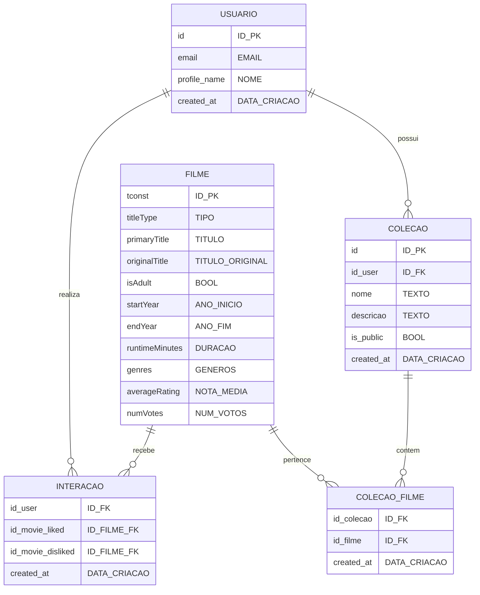

# Documentação do Banco de Dados

## 1. Modelo Conceitual (Diagrama Entidade-Relacionamento)



## 2. Modelo Lógico

### USUARIO
| Campo | Tipo | Restrição |
|-------|------|-----------|
| id | INTEGER | PK |
| email | VARCHAR(255) | UNIQUE |
| profile_name | VARCHAR(100) | |
| created_at | TIMESTAMP | |

### FILME
| Campo | Tipo | Restrição |
|-------|------|-----------|
| tconst | VARCHAR(10) | PK |
| titleType | VARCHAR(50) | |
| primaryTitle | VARCHAR(500) | |
| originalTitle | VARCHAR(500) | |
| isAdult | BOOLEAN | |
| startYear | INTEGER | |
| endYear | INTEGER | |
| runtimeMinutes | INTEGER | |
| genres | TEXT | |
| averageRating | FLOAT | |
| numVotes | INTEGER | |

### INTERACAO
| Campo | Tipo | Restrição |
|-------|------|-----------|
| id_user | INTEGER | FK |
| id_movie_liked | VARCHAR(10) | FK |
| id_movie_disliked | VARCHAR(10) | FK |
| created_at | TIMESTAMP | |
| | | PK(id_user, id_movie_liked, id_movie_disliked) |

### COLECAO
| Campo | Tipo | Restrição |
|-------|------|-----------|
| id | INTEGER | PK |
| id_user | INTEGER | FK |
| nome | VARCHAR(100) | |
| descricao | TEXT | |
| is_public | BOOLEAN | |
| created_at | TIMESTAMP | |

### COLECAO_FILME
| Campo | Tipo | Restrição |
|-------|------|-----------|
| id_colecao | INTEGER | FK |
| id_filme | VARCHAR(10) | FK |
| created_at | TIMESTAMP | |
| | | PK(id_colecao, id_filme) |

## 3. Modelo Físico (Script SQL)

```sql
-- Criação das tabelas
CREATE TABLE users (
    id SERIAL PRIMARY KEY,
    email VARCHAR(255) UNIQUE NOT NULL,
    profile_name VARCHAR(100) NOT NULL,
    created_at TIMESTAMP DEFAULT CURRENT_TIMESTAMP
);

CREATE TABLE movies (
    tconst VARCHAR(10) PRIMARY KEY,
    titleType VARCHAR(50) NOT NULL,
    primaryTitle VARCHAR(500) NOT NULL,
    originalTitle VARCHAR(500) NOT NULL,
    isAdult BOOLEAN DEFAULT FALSE,
    startYear INTEGER,
    endYear INTEGER,
    runtimeMinutes INTEGER,
    genres TEXT,
    averageRating FLOAT,
    numVotes INTEGER
);

CREATE TABLE interactions (
    id_user INTEGER REFERENCES users(id),
    id_movie_liked VARCHAR(10) REFERENCES movies(tconst),
    id_movie_disliked VARCHAR(10) REFERENCES movies(tconst),
    created_at TIMESTAMP DEFAULT CURRENT_TIMESTAMP,
    PRIMARY KEY (id_user, id_movie_liked, id_movie_disliked)
);

CREATE TABLE collections (
    id SERIAL PRIMARY KEY,
    id_user INTEGER REFERENCES users(id),
    nome VARCHAR(100) NOT NULL,
    descricao TEXT,
    is_public BOOLEAN DEFAULT FALSE,
    created_at TIMESTAMP DEFAULT CURRENT_TIMESTAMP
);

CREATE TABLE collection_movies (
    id_collection INTEGER REFERENCES collections(id),
    id_movie VARCHAR(10) REFERENCES movies(tconst),
    created_at TIMESTAMP DEFAULT CURRENT_TIMESTAMP,
    PRIMARY KEY (id_collection, id_movie)
);

-- Índices para otimização
CREATE INDEX idx_user_email ON users(email);
CREATE INDEX idx_movie_title ON movies(primaryTitle);
CREATE INDEX idx_interactions_user ON interactions(id_user);
CREATE INDEX idx_collections_user ON collections(id_user);

-- Constraints adicionais
ALTER TABLE interactions
ADD CONSTRAINT check_movie_interaction
CHECK (id_movie_liked IS NOT NULL OR id_movie_disliked IS NOT NULL);

ALTER TABLE collections
ADD CONSTRAINT unique_collection_name_per_user
UNIQUE (id_user, nome);
```