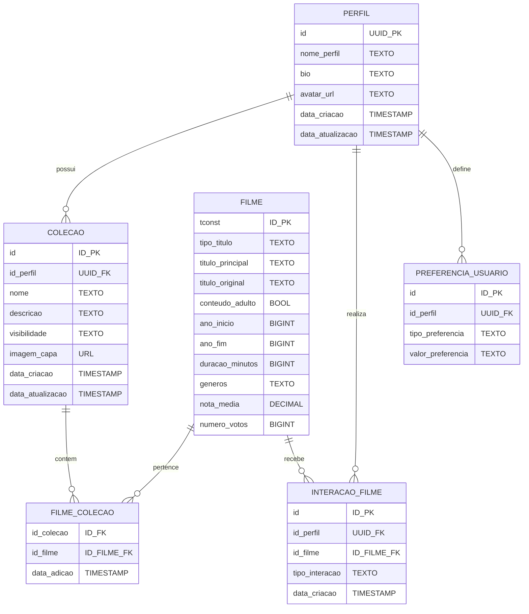

# **Documentação do Banco de Dados**

## **Glossário Técnico das Tabelas**

### **Tabela Perfis (profiles)**

| Coluna       | Descrição                                                          | Tipo de Dado | Formato                | Pode ser Nulo? |
| ------------ | ------------------------------------------------------------------ | ------------ | ---------------------- | -------------- |
| id           | Identificador único do perfil, vinculado ao usuário autenticado.   | uuid         | UUID v4                | Não            |
| created_at   | Data e hora de criação do perfil, considerando o fuso horário UTC. | timestamp    | AAAA-MM-DD HH:MM:SS±TZ | Não            |
| bio          | Texto opcional com a biografia do usuário.                         | string       | texto livre            | Sim            |
| updated_at   | Data e hora da última atualização do perfil.                       | timestamp    | AAAA-MM-DD HH:MM:SS±TZ | Não            |
| avatar_url   | Endereço de imagem utilizado como avatar do perfil.                | string       | URL                    | Sim            |
| profile_name | Nome público do perfil, exibido nas interações sociais e coleções. | string       | texto                  | Não            |

---

### **Tabela Títulos (movies)**

| Coluna         | Descrição                                                      | Tipo de Dado | Formato        | Pode ser Nulo? |
| -------------- | -------------------------------------------------------------- | ------------ | -------------- | -------------- |
| tconst         | Identificador único do título, proveniente do IMDb.            | string       | tt1234567      | Não            |
| titleType      | Categoria do conteúdo (ex: movie, short, series, documentary). | string       | texto          | Sim            |
| primaryTitle   | Nome principal pelo qual o título é conhecido.                 | string       | texto          | Sim            |
| originalTitle  | Nome original no idioma de produção.                           | string       | texto          | Sim            |
| isAdult        | Indica se o conteúdo é voltado para o público adulto.          | booleano     | true ou false  | Sim            |
| startYear      | Ano de lançamento ou início de exibição.                       | inteiro      | AAAA           | Sim            |
| endYear        | Ano de encerramento da exibição (para séries).                 | inteiro      | AAAA           | Sim            |
| runtimeMinutes | Duração total do conteúdo em minutos.                          | inteiro      | número inteiro | Sim            |
| genres         | Lista de gêneros associados, separados por vírgula.            | string       | texto          | Sim            |
| averageRating  | Nota média dos usuários no IMDb.                               | float        | 0.0 a 10.0     | Sim            |
| numVotes       | Quantidade total de votos recebidos.                           | inteiro      | número inteiro | Sim            |

---

### **Tabela Coleções (collections)**

| Coluna          | Descrição                                                              | Tipo de Dado | Formato                | Pode ser Nulo? |
| --------------- | ---------------------------------------------------------------------- | ------------ | ---------------------- | -------------- |
| id              | Identificador único da coleção.                                        | inteiro      | número inteiro         | Não            |
| profile_id      | Identificador do perfil proprietário da coleção.                       | uuid         | UUID v4                | Não            |
| name            | Nome da coleção (ex: “Favoritos”, “Assistir mais tarde”).              | string       | texto                  | Não            |
| description     | Texto descritivo da coleção.                                           | string       | texto                  | Sim            |
| created_at      | Data e hora da criação da coleção.                                     | timestamp    | AAAA-MM-DD HH:MM:SS±TZ | Não            |
| updated_at      | Data e hora da última atualização.                                     | timestamp    | AAAA-MM-DD HH:MM:SS±TZ | Não            |
| visibility      | Define o nível de visibilidade da coleção (public, private, unlisted). | string       | texto                  | Sim            |
| cover_image_url | Endereço da imagem de capa da coleção.                                 | string       | URL                    | Sim            |

---

### **Tabela Filmes em Coleção (collection_movies)**

| Coluna        | Descrição                                            | Tipo de Dado | Formato                | Pode ser Nulo? |
| ------------- | ---------------------------------------------------- | ------------ | ---------------------- | -------------- |
| collection_id | Identificador da coleção que contém o filme.         | inteiro      | número inteiro         | Não            |
| movie_id      | Identificador do filme associado à coleção.          | string       | tt1234567              | Não            |
| added_at      | Data e hora em que o filme foi adicionado à coleção. | timestamp    | AAAA-MM-DD HH:MM:SS±TZ | Não            |

---

### **Tabela Interações de Usuário com Filmes (user_movie_interactions)**

| Coluna           | Descrição                                                  | Tipo de Dado | Formato                | Pode ser Nulo? |
| ---------------- | ---------------------------------------------------------- | ------------ | ---------------------- | -------------- |
| id               | Identificador único da interação.                          | inteiro      | número inteiro         | Não            |
| profile_id       | Identificador do perfil que realizou a interação.          | uuid         | UUID v4                | Não            |
| movie_id         | Identificador do filme com o qual o usuário interagiu.     | string       | tt1234567              | Não            |
| interaction_type | Tipo de interação realizada: 'like' ou 'dislike'.          | string       | texto                  | Não            |
| created_at       | Data e hora da interação, considerando o fuso horário UTC. | timestamp    | AAAA-MM-DD HH:MM:SS±TZ | Não            |

---

### **Tabela Preferências de Usuário (user_preferences)**

| Coluna           | Descrição                                                       | Tipo de Dado | Formato        | Pode ser Nulo? |
| ---------------- | --------------------------------------------------------------- | ------------ | -------------- | -------------- |
| id               | Identificador único da preferência.                             | inteiro      | número inteiro | Não            |
| profile_id       | Identificador do perfil associado à preferência.                | uuid         | UUID v4        | Não            |
| preference_type  | Categoria da preferência (genre, actor, director, decade).      | string       | texto          | Não            |
| preference_value | Valor correspondente à preferência (ex: “Action”, “Brad Pitt”). | string       | texto          | Não            |

---

### **Resumo das Relações entre Tabelas**

| Relação                                        | Tipo                                               | Descrição |
| ---------------------------------------------- | -------------------------------------------------- | --------- |
| **profiles** 1 → N **collections**             | Um perfil pode ter várias coleções.                |           |
| **collections** 1 → N **collection_movies**    | Cada coleção contém vários filmes.                 |           |
| **movies** 1 → N **collection_movies**         | Um filme pode estar em várias coleções.            |           |
| **profiles** 1 → N **user_movie_interactions** | Um perfil pode curtir ou não curtir vários filmes. |           |
| **movies** 1 → N **user_movie_interactions**   | Um filme pode receber interações de vários perfis. |           |
| **profiles** 1 → N **user_preferences**        | Um perfil pode ter várias preferências.            |           |

---

---

## 1. Modelo Conceitual (Diagrama Entidade-Relacionamento)



---

## **2. Modelo Lógico**

### **PERFIL**

| Campo            | Tipo      | Restrição                          |
| ---------------- | --------- | ---------------------------------- |
| id               | UUID      | PK, DEFAULT `auth.uid()`           |
| nome_perfil      | TEXT      | UNIQUE, NOT NULL                   |
| bio              | TEXT      |                                    |
| avatar_url       | TEXT      |                                    |
| data_criacao     | TIMESTAMP | DEFAULT `now() AT TIME ZONE 'utc'` |
| data_atualizacao | TIMESTAMP | DEFAULT `now() AT TIME ZONE 'utc'` |
| fk_auth_user     | UUID      | FK → `auth.users(id)`              |

---

### **COLEÇÃO**

| Campo            | Tipo      | Restrição                                                         |
| ---------------- | --------- | ----------------------------------------------------------------- |
| id               | BIGINT    | PK, IDENTITY                                                      |
| id_perfil        | UUID      | FK → `profiles(id)`                                               |
| nome             | TEXT      | NOT NULL                                                          |
| descricao        | TEXT      |                                                                   |
| visibilidade     | TEXT      | CHECK (`'public'`, `'private'`, `'unlisted'`), DEFAULT `'public'` |
| imagem_capa      | TEXT      |                                                                   |
| data_criacao     | TIMESTAMP | DEFAULT `now() AT TIME ZONE 'utc'`                                |
| data_atualizacao | TIMESTAMP | DEFAULT `now() AT TIME ZONE 'utc'`                                |

---

### **FILME**

| Campo            | Tipo             | Restrição |
| ---------------- | ---------------- | --------- |
| tconst           | TEXT             | PK        |
| tipo_titulo      | TEXT             |           |
| titulo_principal | TEXT             |           |
| titulo_original  | TEXT             |           |
| conteudo_adulto  | BOOLEAN          |           |
| ano_inicio       | BIGINT           |           |
| ano_fim          | BIGINT           |           |
| duracao_minutos  | BIGINT           |           |
| generos          | TEXT             |           |
| nota_media       | DOUBLE PRECISION |           |
| numero_votos     | BIGINT           |           |

---

### **FILME_COLEÇÃO**

| Campo       | Tipo      | Restrição                          |
| ----------- | --------- | ---------------------------------- |
| id_colecao  | BIGINT    | PK, FK → `collections(id)`         |
| id_filme    | TEXT      | PK, FK → `movies(tconst)`          |
| data_adicao | TIMESTAMP | DEFAULT `now() AT TIME ZONE 'utc'` |

---

### **INTERAÇÃO_FILME**

| Campo          | Tipo      | Restrição                                    |
| -------------- | --------- | -------------------------------------------- |
| id             | BIGINT    | PK, IDENTITY                                 |
| id_perfil      | UUID      | FK → `profiles(id)`                          |
| id_filme       | TEXT      | FK → `movies(tconst)`                        |
| tipo_interacao | TEXT      | CHECK (`'like'`, `'dislike'`)                |
| data_criacao   | TIMESTAMP | DEFAULT `now() AT TIME ZONE 'utc'`, NOT NULL |

---

### **PREFERÊNCIA_USUÁRIO**

| Campo             | Tipo   | Restrição                                              |
| ----------------- | ------ | ------------------------------------------------------ |
| id                | BIGINT | PK, IDENTITY                                           |
| id_perfil         | UUID   | FK → `profiles(id)`                                    |
| tipo_preferencia  | TEXT   | CHECK (`'genre'`, `'actor'`, `'director'`, `'decade'`) |
| valor_preferencia | TEXT   | NOT NULL                                               |

---

## 3. Modelo Físico (Script SQL)

```sql
-- Criação das tabelas
-- WARNING: This schema is for context only and is not meant to be run.
-- Table order and constraints may not be valid for execution.

CREATE TABLE public.collection_movies (
  collection_id bigint NOT NULL,
  movie_id text NOT NULL,
  added_at timestamp with time zone DEFAULT (now() AT TIME ZONE 'utc'::text),
  CONSTRAINT collection_movies_pkey PRIMARY KEY (collection_id, movie_id),
  CONSTRAINT collection_movies_collection_id_fkey FOREIGN KEY (collection_id) REFERENCES public.collections(id),
  CONSTRAINT collection_movies_movie_id_fkey FOREIGN KEY (movie_id) REFERENCES public.movies(tconst)
);
CREATE TABLE public.collections (
  id bigint GENERATED ALWAYS AS IDENTITY NOT NULL,
  profile_id uuid NOT NULL,
  name text NOT NULL,
  description text,
  created_at timestamp with time zone DEFAULT (now() AT TIME ZONE 'utc'::text),
  updated_at timestamp with time zone DEFAULT (now() AT TIME ZONE 'utc'::text),
  visibility text DEFAULT 'public'::text CHECK (visibility = ANY (ARRAY['public'::text, 'private'::text, 'unlisted'::text])),
  cover_image_url text,
  CONSTRAINT collections_pkey PRIMARY KEY (id),
  CONSTRAINT fk_collections_profile FOREIGN KEY (profile_id) REFERENCES public.profiles(id)
);
CREATE TABLE public.movies (
  tconst text NOT NULL,
  titleType text,
  primaryTitle text,
  originalTitle text,
  isAdult boolean,
  startYear bigint,
  endYear bigint,
  runtimeMinutes bigint,
  genres text,
  averageRating double precision,
  numVotes bigint,
  CONSTRAINT movies_pkey PRIMARY KEY (tconst)
);
CREATE TABLE public.profiles (
  id uuid NOT NULL DEFAULT auth.uid(),
  created_at timestamp with time zone DEFAULT (now() AT TIME ZONE 'utc'::text),
  bio text,
  updated_at timestamp with time zone DEFAULT (now() AT TIME ZONE 'utc'::text),
  avatar_url text,
  profile_name text NOT NULL UNIQUE,
  CONSTRAINT profiles_pkey PRIMARY KEY (id),
  CONSTRAINT profiles_id_fkey FOREIGN KEY (id) REFERENCES auth.users(id)
);
CREATE TABLE public.user_movie_interactions (
  created_at timestamp with time zone NOT NULL DEFAULT (now() AT TIME ZONE 'utc'::text),
  interaction_type text CHECK (interaction_type = ANY (ARRAY['like'::text, 'dislike'::text])),
  id bigint GENERATED ALWAYS AS IDENTITY NOT NULL,
  profile_id uuid,
  movie_id text,
  CONSTRAINT user_movie_interactions_pkey PRIMARY KEY (id),
  CONSTRAINT fk_user_profile FOREIGN KEY (profile_id) REFERENCES public.profiles(id),
  CONSTRAINT fk_user_movie FOREIGN KEY (movie_id) REFERENCES public.movies(tconst)
);
CREATE TABLE public.user_preferences (
  id bigint GENERATED ALWAYS AS IDENTITY NOT NULL,
  profile_id uuid,
  preference_type text CHECK (preference_type = ANY (ARRAY['genre'::text, 'actor'::text, 'director'::text, 'decade'::text])),
  preference_value text NOT NULL,
  CONSTRAINT user_preferences_pkey PRIMARY KEY (id),
  CONSTRAINT user_preferences_profile_id_fkey FOREIGN KEY (profile_id) REFERENCES public.profiles(id)
);
```

---

## 1. Requisitos Funcionais

Os requisitos abaixo descrevem as principais funcionalidades do sistema que
envolvem operações com o banco de dados:

- **Cadastro de usuários**
  - Inserção de dados na tabela de usuários
  - Validação de dados únicos (email, nome_perfil)

- **Interações com filmes**
  - Registro de curtidas/descurtidas
  - Armazenamento do histórico de interações

- **Busca e filtros**
  - Busca de filmes por gênero
  - Filtros por avaliação
  - Controle de conteúdo adulto

---

## 2. Modelo de Dados

### 2.1 Estrutura

- Diagrama Entidade-Relacionamento (DER)
- Modelo Relacional
- Dicionário de dados das tabelas
- Mapeamento dos relacionamentos

### 2.2 Relacionamentos

- Usuário → Interações (1:N)
- Filme → Interações (1:N)

---

## 3. Requisitos Não Funcionais

### 3.1 Performance

- Tempo de resposta das consultas
- Otimização de índices
- Cache de consultas frequentes

### 3.2 Segurança

- Criptografia de dados sensíveis
- Controle de acesso
- Proteção contra injeção SQL

### 3.3 Escalabilidade

- Capacidade de crescimento
- Particionamento de dados
- Balanceamento de carga

### 3.4 Backup e Recuperação

- Políticas de backup
- Procedimentos de recuperação
- Retenção de dados

---

## 4. Regras de Negócio

### 4.1 Interações

- Um usuário não pode curtir e descurtir o mesmo filme simultaneamente
- Todas as interações devem ser registradas com timestamp

### 4.2 Conteúdo

- Filmes adultos têm acesso restrito
- Classificação etária deve ser respeitada

---

## 5. Requisitos de Integração

### 5.1 APIs Externas

- Integração com IMDb
- Sincronização periódica
- Tratamento de inconsistências

### 5.2 Formato dos Dados

- Padronização de dados importados
- Mapeamento de campos externos
- Validação de integridade
