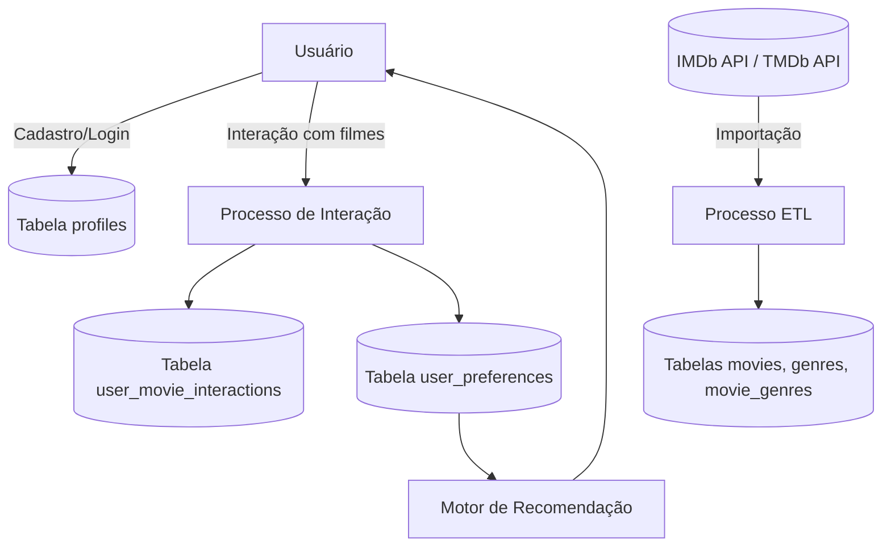
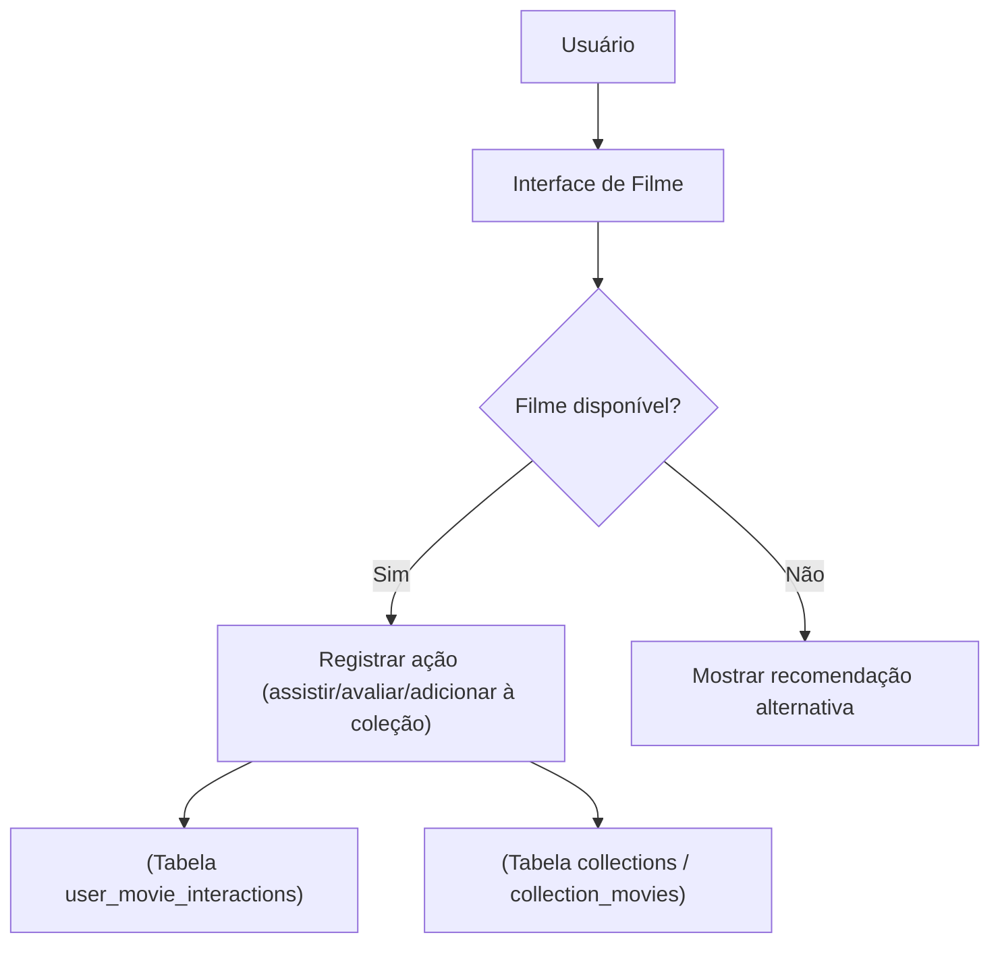

# **Documentação do Banco de Dados**

Este documento descreve detalhadamente o modelo de dados, regras de negócio,
requisitos e extensões futuras do sistema de gerenciamento de filmes, coleções e
interações de usuários.

## **Sumário**

### Parte 1 — Estrutura e Contexto

1. [Glossário de Termos e Siglas](#1-glossário-de-termos-e-siglas)
2. [Glossário Técnico das Tabelas](#2-glossário-técnico-das-tabelas)
3. [Modelo Conceitual (Diagrama Entidade-Relacionamento)](#3-modelo-conceitual-diagrama-entidade-relacionamento)
4. [Modelo Lógico](#4-modelo-lógico)
5. [Modelo Físico (Script SQL)](#5-modelo-físico-script-sql)

### Parte 2 — Operações e Regras

6. [Requisitos Funcionais](#6-requisitos-funcionais)
7. [Modelo de Dados](#7-modelo-de-dados)
8. [Diagrama de Fluxo de Dados (DFD)](#8-diagrama-de-fluxo-de-dados-dfd)
9. [Requisitos Não Funcionais](#9-requisitos-não-funcionais)
10. [Regras de Negócio](#10-regras-de-negócio)
11. [Requisitos de Integração](#11-requisitos-de-integração)

### Parte 3 — Manutenção e Evolução

12. [Considerações Finais](#12-considerações-finais)
13. [Extensões Futuras](#13-extensões-futuras)
14. [Histórico de Alterações (Changelog)](#14-histórico-de-alterações-changelog)
15. [Notas de Performance e Escalabilidade](#15-notas-de-performance-e-escalabilidade)
16. [Guia de Nomenclatura e Convenções](#16-guia-de-nomenclatura-e-convenções)
17. [Referências Técnicas](#17-referências-técnicas)
18. [Plano de Evolução Técnica](#18-plano-de-evolução-técnica)

---

## 1. Glossário de Termos e Siglas

Este glossário descreve os principais termos e siglas utilizados na documentação
do banco de dados e no sistema.

| Termo / Sigla                              | Descrição                                                                                                                                                                                                              |
| ------------------------------------------ | ---------------------------------------------------------------------------------------------------------------------------------------------------------------------------------------------------------------------- |
| **RLS (Row Level Security)**               | Política de segurança no nível de linha do banco de dados. Permite controlar quais linhas cada usuário pode acessar ou modificar. No Supabase/PostgreSQL, é usada para aplicar regras de acesso dinâmicas por usuário. |
| **Supabase**                               | Plataforma backend open-source que oferece banco de dados PostgreSQL, autenticação, storage e funções serverless, simplificando a construção de aplicações web e mobile.                                               |
| **UUID (Universally Unique Identifier)**   | Identificador único global, utilizado para garantir unicidade de registros sem depender de números sequenciais. Ex.: `550e8400-e29b-41d4-a716-446655440000`.                                                           |
| **ETL (Extract, Transform, Load)**         | Processo de extração, transformação e carregamento de dados, usado para importar e padronizar informações de fontes externas como a API IMDb.                                                                          |
| **IMDb (Internet Movie Database)**         | Base de dados online de filmes, séries e profissionais da indústria audiovisual. Fonte principal de dados de títulos no sistema.                                                                                       |
| **tconst**                                 | Identificador único de títulos na base IMDb, utilizado como chave primária na tabela `movies`. Ex.: `tt0111161`.                                                                                                       |
| **Chave Primária (PK)**                    | Coluna ou conjunto de colunas que identifica unicamente cada registro de uma tabela.                                                                                                                                   |
| **Chave Estrangeira (FK)**                 | Coluna que cria vínculo com a chave primária de outra tabela, garantindo integridade referencial.                                                                                                                      |
| **Constraint**                             | Restrição aplicada a uma tabela ou coluna para garantir integridade dos dados, como `CHECK`, `UNIQUE` ou `FOREIGN KEY`.                                                                                                |
| **Coleção (Collection)**                   | Agrupamento de filmes criado por um usuário para organização, curadoria ou compartilhamento.                                                                                                                           |
| **Interação (Interaction)**                | Ação do usuário em relação a um filme, como `like` ou `dislike`.                                                                                                                                                       |
| **RLS Policy**                             | Conjunto de regras definidas para controlar acesso a linhas de uma tabela específica com base no perfil do usuário.                                                                                                    |
| **Cache**                                  | Armazenamento temporário de dados frequentemente acessados para reduzir tempo de resposta de consultas.                                                                                                                |
| **Backup**                                 | Cópia de segurança dos dados do banco, utilizada para restaurar informações em caso de falhas ou perda de dados.                                                                                                       |
| **Sharding**                               | Estratégia de particionamento horizontal do banco de dados para distribuir dados entre múltiplas instâncias, aumentando a escalabilidade.                                                                              |
| **Streaming Provider**                     | Serviço externo que disponibiliza filmes ou séries online, como Netflix, Disney+ ou Amazon Prime.                                                                                                                      |
| **Gamificação**                            | Aplicação de mecânicas de jogos (como conquistas e pontos) para aumentar engajamento do usuário no sistema.                                                                                                            |
| **DER (Diagrama Entidade-Relacionamento)** | Representação gráfica das entidades do banco de dados e seus relacionamentos.                                                                                                                                          |
| **KPIs (Key Performance Indicators)**      | Indicadores-chave de desempenho, usados para medir a eficiência ou impacto de processos e funcionalidades do sistema.                                                                                                  |

---

## 2. Glossário Técnico das Tabelas

### **Tabela Perfis (`profiles`)**

| Coluna       | Descrição                                                          | Tipo de Dado | Formato                | Pode ser Nulo? |
| ------------ | ------------------------------------------------------------------ | ------------ | ---------------------- | -------------- |
| id           | Identificador único do perfil, vinculado ao usuário autenticado.   | uuid         | UUID v4                | Não            |
| created_at   | Data e hora de criação do perfil, considerando o fuso horário UTC. | timestamp    | AAAA-MM-DD HH:MM:SS±TZ | Não            |
| bio          | Texto opcional com a biografia do usuário.                         | string       | texto livre            | Sim            |
| updated_at   | Data e hora da última atualização do perfil.                       | timestamp    | AAAA-MM-DD HH:MM:SS±TZ | Não            |
| avatar_url   | Endereço de imagem utilizado como avatar do perfil.                | string       | URL                    | Sim            |
| profile_name | Nome público do perfil, exibido nas interações sociais e coleções. | string       | texto                  | Não            |

---

### **Tabela Tipos de Título (`title_types`)**

| Coluna    | Descrição                                            | Tipo de Dado | Formato        | Pode ser Nulo? |
| --------- | ---------------------------------------------------- | ------------ | -------------- | -------------- |
| id        | Identificador único do tipo de título.               | inteiro      | número inteiro | Não            |
| type_name | Nome do tipo de título (ex: movie, short, tvSeries). | string       | texto          | Não            |

---

### **Tabela Gêneros (`genres`)**

| Coluna | Descrição                           | Tipo de Dado | Formato        | Pode ser Nulo? |
| ------ | ----------------------------------- | ------------ | -------------- | -------------- |
| id     | Identificador único do gênero.      | inteiro      | número inteiro | Não            |
| name   | Nome do gênero (ex: Action, Drama). | string       | texto          | Não            |

---

### **Tabela Filmes (`movies`)**

| Coluna          | Descrição                                             | Tipo de Dado | Formato        | Pode ser Nulo? |
| --------------- | ----------------------------------------------------- | ------------ | -------------- | -------------- |
| tconst          | Identificador único do título, proveniente do IMDb.   | string       | tt1234567      | Não            |
| title_type_id   | Chave estrangeira para o tipo de título.              | inteiro      | número inteiro | Sim            |
| primary_title   | Nome principal pelo qual o título é conhecido.        | string       | texto          | Sim            |
| original_title  | Nome original no idioma de produção.                  | string       | texto          | Sim            |
| is_adult        | Indica se o conteúdo é voltado para o público adulto. | booleano     | true/false     | Sim            |
| start_year      | Ano de lançamento ou início de exibição.              | inteiro      | AAAA           | Sim            |
| end_year        | Ano de encerramento da exibição (para séries).        | inteiro      | AAAA           | Sim            |
| runtime_minutes | Duração total do conteúdo em minutos.                 | inteiro      | número inteiro | Sim            |
| average_rating  | Nota média dos usuários no IMDb.                      | float        | 0.0 a 10.0     | Sim            |
| num_votes       | Quantidade total de votos recebidos.                  | inteiro      | número inteiro | Sim            |

---

### **Tabela Gêneros por Filme (`movie_genres`)**

| Coluna   | Descrição                                        | Tipo de Dado | Formato        | Pode ser Nulo? |
| -------- | ------------------------------------------------ | ------------ | -------------- | -------------- |
| movie_id | Identificador do filme associado (FK → movies).  | string       | tt1234567      | Não            |
| genre_id | Identificador do gênero associado (FK → genres). | inteiro      | número inteiro | Não            |

---

### **Tabela Coleções (`collections`)**

| Coluna          | Descrição                                                   | Tipo de Dado | Formato                | Pode ser Nulo? |
| --------------- | ----------------------------------------------------------- | ------------ | ---------------------- | -------------- |
| id              | Identificador único da coleção.                             | inteiro      | número inteiro         | Não            |
| profile_id      | Identificador do perfil proprietário da coleção.            | uuid         | UUID v4                | Não            |
| name            | Nome da coleção (ex: “Favoritos”, “Assistir mais tarde”).   | string       | texto                  | Não            |
| description     | Texto descritivo da coleção.                                | string       | texto                  | Sim            |
| created_at      | Data e hora da criação da coleção.                          | timestamp    | AAAA-MM-DD HH:MM:SS±TZ | Não            |
| updated_at      | Data e hora da última atualização.                          | timestamp    | AAAA-MM-DD HH:MM:SS±TZ | Não            |
| visibility      | Define o nível de visibilidade (public, private, unlisted). | string       | texto                  | Sim            |
| cover_image_url | Endereço da imagem de capa da coleção.                      | string       | URL                    | Sim            |

---

### **Tabela Filmes em Coleções (`collection_movies`)**

| Coluna        | Descrição                                            | Tipo de Dado | Formato                | Pode ser Nulo? |
| ------------- | ---------------------------------------------------- | ------------ | ---------------------- | -------------- |
| collection_id | Identificador da coleção que contém o filme.         | inteiro      | número inteiro         | Não            |
| movie_id      | Identificador do filme associado à coleção.          | string       | tt1234567              | Não            |
| added_at      | Data e hora em que o filme foi adicionado à coleção. | timestamp    | AAAA-MM-DD HH:MM:SS±TZ | Não            |

---

### **Tabela Interações de Usuário com Filmes (`user_movie_interactions`)**

| Coluna           | Descrição                                         | Tipo de Dado | Formato                | Pode ser Nulo? |
| ---------------- | ------------------------------------------------- | ------------ | ---------------------- | -------------- |
| id               | Identificador único da interação.                 | inteiro      | número inteiro         | Não            |
| profile_id       | Identificador do perfil que realizou a interação. | uuid         | UUID v4                | Não            |
| movie_id         | Identificador do filme com o qual interagiu.      | string       | tt1234567              | Não            |
| interaction_type | Tipo de interação: 'like' ou 'dislike'.           | string       | texto                  | Não            |
| created_at       | Data e hora da interação (UTC).                   | timestamp    | AAAA-MM-DD HH:MM:SS±TZ | Não            |

---

### **Tabela Preferências de Usuário (`user_preferences`)**

| Coluna           | Descrição                                             | Tipo de Dado | Formato        | Pode ser Nulo? |
| ---------------- | ----------------------------------------------------- | ------------ | -------------- | -------------- |
| id               | Identificador único da preferência.                   | inteiro      | número inteiro | Não            |
| profile_id       | Identificador do perfil associado à preferência.      | uuid         | UUID v4        | Não            |
| preference_type  | Tipo da preferência (genre, actor, director, decade). | string       | texto          | Não            |
| preference_value | Valor da preferência (ex: “Action”, “Brad Pitt”).     | string       | texto          | Não            |

---

### **Resumo das Relações entre Tabelas**

| Relação                                        | Tipo                                                      |
| ---------------------------------------------- | --------------------------------------------------------- |
| **profiles** 1 → N **collections**             | Um perfil pode ter várias coleções.                       |
| **collections** 1 → N **collection_movies**    | Cada coleção contém vários filmes.                        |
| **movies** 1 → N **collection_movies**         | Um filme pode estar em várias coleções.                   |
| **profiles** 1 → N **user_movie_interactions** | Um perfil pode interagir com vários filmes.               |
| **movies** 1 → N **user_movie_interactions**   | Um filme pode receber várias interações.                  |
| **profiles** 1 → N **user_preferences**        | Um perfil pode ter várias preferências.                   |
| **title_types** 1 → N **movies**               | Cada tipo de título pode estar associado a vários filmes. |
| **genres** N → N **movies**                    | Relacionamento feito via `movie_genres`.                  |

---

## 3. Modelo Conceitual (Diagrama Entidade-Relacionamento)


---

## 4. Modelo Lógico

### PERFIL (`profiles`)

| Campo        | Tipo      | Restrição                          |
| ------------ | --------- | ---------------------------------- |
| id           | UUID      | PK, DEFAULT `auth.uid()`           |
| profile_name | TEXT      | UNIQUE, NOT NULL                   |
| bio          | TEXT      |                                    |
| avatar_url   | TEXT      |                                    |
| created_at   | TIMESTAMP | DEFAULT `now() AT TIME ZONE 'utc'` |
| updated_at   | TIMESTAMP | DEFAULT `now() AT TIME ZONE 'utc'` |
| fk_auth_user | UUID      | FK → `auth.users(id)`              |

---

### COLEÇÃO (`collections`)

| Campo           | Tipo      | Restrição                                                 |
| --------------- | --------- | --------------------------------------------------------- |
| id              | BIGINT    | PK, IDENTITY                                              |
| profile_id      | UUID      | FK → `profiles(id)`                                       |
| name            | TEXT      | NOT NULL                                                  |
| description     | TEXT      |                                                           |
| visibility      | TEXT      | CHECK ('public', 'private', 'unlisted'), DEFAULT 'public' |
| cover_image_url | TEXT      |                                                           |
| created_at      | TIMESTAMP | DEFAULT `now() AT TIME ZONE 'utc'`                        |
| updated_at      | TIMESTAMP | DEFAULT `now() AT TIME ZONE 'utc'`                        |

---

### FILME (`movies`)

| Campo           | Tipo             | Restrição              |
| --------------- | ---------------- | ---------------------- |
| tconst          | TEXT             | PK                     |
| title_type_id   | BIGINT           | FK → `title_types(id)` |
| primary_title   | TEXT             |                        |
| original_title  | TEXT             |                        |
| is_adult        | BOOLEAN          |                        |
| start_year      | BIGINT           |                        |
| end_year        | BIGINT           |                        |
| runtime_minutes | BIGINT           |                        |
| average_rating  | DOUBLE PRECISION |                        |
| num_votes       | BIGINT           |                        |

---

### TIPO DE TÍTULO (`title_types`)

| Campo     | Tipo   | Restrição        |
| --------- | ------ | ---------------- |
| id        | BIGINT | PK, IDENTITY     |
| type_name | TEXT   | UNIQUE, NOT NULL |

---

### GÊNERO (`genres`)

| Campo | Tipo   | Restrição        |
| ----- | ------ | ---------------- |
| id    | BIGINT | PK, IDENTITY     |
| name  | TEXT   | UNIQUE, NOT NULL |

---

### FILME_GÊNEROS (`movie_genres`)

| Campo    | Tipo   | Restrição                 |
| -------- | ------ | ------------------------- |
| movie_id | TEXT   | PK, FK → `movies(tconst)` |
| genre_id | BIGINT | PK, FK → `genres(id)`     |

---

### FILME_COLEÇÃO (`collection_movies`)

| Campo         | Tipo      | Restrição                          |
| ------------- | --------- | ---------------------------------- |
| collection_id | BIGINT    | PK, FK → `collections(id)`         |
| movie_id      | TEXT      | PK, FK → `movies(tconst)`          |
| added_at      | TIMESTAMP | DEFAULT `now() AT TIME ZONE 'utc'` |

---

### INTERAÇÃO_FILME (`user_movie_interactions`)

| Campo            | Tipo      | Restrição                                    |
| ---------------- | --------- | -------------------------------------------- |
| id               | BIGINT    | PK, IDENTITY                                 |
| profile_id       | UUID      | FK → `profiles(id)`                          |
| movie_id         | TEXT      | FK → `movies(tconst)`                        |
| interaction_type | TEXT      | CHECK ('like', 'dislike')                    |
| created_at       | TIMESTAMP | DEFAULT `now() AT TIME ZONE 'utc'`, NOT NULL |

---

### PREFERÊNCIA_USUÁRIO (`user_preferences`)

| Campo            | Tipo   | Restrição                                      |
| ---------------- | ------ | ---------------------------------------------- |
| id               | BIGINT | PK, IDENTITY                                   |
| profile_id       | UUID   | FK → `profiles(id)`                            |
| preference_type  | TEXT   | CHECK ('genre', 'actor', 'director', 'decade') |
| preference_value | TEXT   | NOT NULL                                       |

---

## 5. Modelo Físico (Script SQL)

```sql
-- WARNING: This schema is for context only and is not meant to be run.
-- Table order and constraints may not be valid for execution.

CREATE TABLE public.collection_movies (
  collection_id bigint NOT NULL,
  movie_id text NOT NULL,
  added_at timestamp with time zone DEFAULT (now() AT TIME ZONE 'utc'::text),
  CONSTRAINT collection_movies_pkey PRIMARY KEY (collection_id, movie_id),
  CONSTRAINT collection_movies_collection_id_fkey FOREIGN KEY (collection_id) REFERENCES public.collections(id),
  CONSTRAINT collection_movies_movie_id_fkey FOREIGN KEY (movie_id) REFERENCES public.movies(tconst)
);
CREATE TABLE public.collections (
  id bigint GENERATED ALWAYS AS IDENTITY NOT NULL,
  profile_id uuid NOT NULL,
  name text NOT NULL,
  description text,
  created_at timestamp with time zone DEFAULT (now() AT TIME ZONE 'utc'::text),
  updated_at timestamp with time zone DEFAULT (now() AT TIME ZONE 'utc'::text),
  visibility text DEFAULT 'public'::text CHECK (visibility = ANY (ARRAY['public'::text, 'private'::text, 'unlisted'::text])),
  cover_image_url text,
  CONSTRAINT collections_pkey PRIMARY KEY (id),
  CONSTRAINT fk_collections_profile FOREIGN KEY (profile_id) REFERENCES public.profiles(id)
);
CREATE TABLE public.genres (
  id bigint NOT NULL DEFAULT nextval('genres_id_seq'::regclass),
  name text NOT NULL UNIQUE,
  CONSTRAINT genres_pkey PRIMARY KEY (id)
);
CREATE TABLE public.movie_genres (
  movie_id text NOT NULL,
  genre_id bigint NOT NULL,
  CONSTRAINT movie_genres_pkey PRIMARY KEY (movie_id, genre_id),
  CONSTRAINT movie_genres_movie_id_fkey FOREIGN KEY (movie_id) REFERENCES public.movies(tconst),
  CONSTRAINT movie_genres_genre_id_fkey FOREIGN KEY (genre_id) REFERENCES public.genres(id)
);
CREATE TABLE public.movies (
  tconst text NOT NULL,
  title_type_id bigint,
  primary_title text NOT NULL,
  original_title text,
  is_adult boolean,
  start_year smallint,
  end_year smallint,
  runtime_minutes smallint,
  average_rating double precision,
  num_votes bigint,
  CONSTRAINT movies_pkey PRIMARY KEY (tconst),
  CONSTRAINT movies_new_title_type_id_fkey FOREIGN KEY (title_type_id) REFERENCES public.title_types(id)
);
CREATE TABLE public.movies_old (
  tconst text NOT NULL,
  title_type_id text,
  primary_title text,
  original_title text,
  is_adult boolean,
  start_year bigint,
  end_year bigint,
  runtime_minutes bigint,
  genres text,
  average_rating double precision,
  num_votes bigint,
  CONSTRAINT movies_old_pkey PRIMARY KEY (tconst)
);
CREATE TABLE public.profiles (
  id uuid NOT NULL DEFAULT auth.uid(),
  created_at timestamp with time zone DEFAULT (now() AT TIME ZONE 'utc'::text),
  bio text,
  updated_at timestamp with time zone DEFAULT (now() AT TIME ZONE 'utc'::text),
  avatar_url text,
  profile_name text NOT NULL UNIQUE,
  CONSTRAINT profiles_pkey PRIMARY KEY (id),
  CONSTRAINT profiles_id_fkey FOREIGN KEY (id) REFERENCES auth.users(id)
);
CREATE TABLE public.title_types (
  id bigint NOT NULL DEFAULT nextval('title_types_id_seq'::regclass),
  type_name text NOT NULL UNIQUE,
  CONSTRAINT title_types_pkey PRIMARY KEY (id)
);
CREATE TABLE public.user_movie_interactions (
  created_at timestamp with time zone NOT NULL DEFAULT (now() AT TIME ZONE 'utc'::text),
  interaction_type text CHECK (interaction_type = ANY (ARRAY['like'::text, 'dislike'::text])),
  id bigint GENERATED ALWAYS AS IDENTITY NOT NULL,
  profile_id uuid,
  movie_id text,
  CONSTRAINT user_movie_interactions_pkey PRIMARY KEY (id),
  CONSTRAINT fk_user_profile FOREIGN KEY (profile_id) REFERENCES public.profiles(id),
  CONSTRAINT fk_user_movie FOREIGN KEY (movie_id) REFERENCES public.movies(tconst)
);
CREATE TABLE public.user_preferences (
  id bigint GENERATED ALWAYS AS IDENTITY NOT NULL,
  profile_id uuid,
  preference_type text CHECK (preference_type = ANY (ARRAY['genre'::text, 'actor'::text, 'director'::text, 'decade'::text])),
  preference_value text NOT NULL,
  CONSTRAINT user_preferences_pkey PRIMARY KEY (id),
  CONSTRAINT user_preferences_profile_id_fkey FOREIGN KEY (profile_id) REFERENCES public.profiles(id)
);

```

---

## 6. Requisitos Funcionais

Os requisitos abaixo descrevem as principais funcionalidades do sistema,
considerando a nova estrutura do banco de dados:

- **Cadastro e gerenciamento de usuários**
- Inserção de dados na tabela `profiles`
- Validação de dados únicos (`profile_name`, email do usuário)
- Atualização de perfil e avatar
- **Interações com filmes**
- Registro de curtidas e descurtidas (`user_movie_interactions`)
- Registro de avaliações pessoais (`user_ratings`)
- Armazenamento do histórico de visualizações (`watch_history`)
- **Coleções de filmes**
- Criação e gerenciamento de coleções (`collections`)
- Adição e remoção de filmes em coleções (`collection_movies`)
- Coleções colaborativas com diferentes níveis de permissão
  (`collection_members`)
- **Busca e filtros**
- Busca de filmes por título, gênero (`movie_genres`) ou tipo de título
  (`title_types`)
- Filtros por avaliação média (`average_rating`) e número de votos
- Controle de conteúdo adulto (`is_adult`)
- **Integração com fontes externas**
- Importação e atualização de dados via API IMDb
- Integração com provedores de streaming (`movie_providers`)

---

## 7. Modelo de Dados

### 7.1 Estrutura

O modelo contempla todas as entidades do sistema, incluindo:

- Usuários e perfis (`profiles`)
- Filmes, tipos de título (`title_types`) e gêneros (`genres`)
- Coleções e filmes em coleções (`collections`, `collection_movies`,
  `collection_members`)
- Interações e preferências do usuário (`user_movie_interactions`,
  `user_ratings`, `user_preferences`, `watch_history`)
- Integração com provedores externos (`movie_providers`)
- Gamificação e conquistas (`achievements`, `user_achievements`)
- Comentários de usuários (`comments`)

### 7.2 Relacionamentos

| Entidade Origem         | Entidade Destino                        | Tipo de Relacionamento | Descrição                                              |
| ----------------------- | --------------------------------------- | ---------------------- | ------------------------------------------------------ |
| Usuário (`profiles`)    | Interações (`user_movie_interactions`)  | 1:N                    | Um usuário pode interagir com vários filmes            |
| Usuário (`profiles`)    | Avaliações (`user_ratings`)             | 1:N                    | Um usuário pode avaliar cada filme apenas uma vez      |
| Usuário (`profiles`)    | Coleções (`collections`)                | 1:N                    | Um usuário pode criar várias coleções                  |
| Coleção (`collections`) | Filmes em Coleção (`collection_movies`) | 1:N                    | Uma coleção pode conter vários filmes                  |
| Filme (`movies`)        | Filmes em Coleção (`collection_movies`) | 1:N                    | Um filme pode estar em várias coleções                 |
| Usuário (`profiles`)    | Preferências (`user_preferences`)       | 1:N                    | Um usuário pode definir múltiplas preferências         |
| Usuário (`profiles`)    | Histórico (`watch_history`)             | 1:N                    | Um usuário pode ter vários registros de visualização   |
| Filme (`movies`)        | Gêneros (`movie_genres`)                | N:N                    | Um filme pode ter múltiplos gêneros                    |
| Usuário (`profiles`)    | Comentários (`comments`)                | 1:N                    | Um usuário pode comentar vários filmes                 |
| Usuário (`profiles`)    | Conquistas (`user_achievements`)        | 1:N                    | Um usuário pode ganhar múltiplas conquistas            |
| Filme (`movies`)        | Provedores (`movie_providers`)          | 1:N                    | Um filme pode estar disponível em múltiplos provedores |

---

## 8. Diagrama de Fluxo de Dados (DFD)

### Descrição

O Diagrama de Fluxo de Dados (DFD) representa o caminho percorrido pelas
informações desde sua origem até o destino final, ilustrando os processos
internos, entidades externas e repositórios de dados envolvidos.

### DFD - Nível 0



### DFD - Nível 1 (Detalhamento do Processo de Interação)



---

## 9. Requisitos Não Funcionais

### 9.1 Performance

- Consultas de filmes, gêneros e coleções devem responder em até 200ms
- Índices em `tconst`, `profile_id`, `collection_id` e `genre_id`
- Cache para filmes mais populares e recomendações

### 9.2 Segurança

- Criptografia de dados sensíveis e tokens
- Controle de acesso RLS no Supabase
- Proteção contra injeção SQL e acessos não autorizados
- Logs de auditoria para ações críticas

### 9.3 Escalabilidade

- Estrutura compatível com sharding e replicação
- Suporte ao aumento de usuários e volume de dados
- Balanceamento de carga entre múltiplas instâncias

### 9.4 Backup e Recuperação

- Backups automáticos diários e retenção mínima de 7 dias
- Procedimentos de restauração testados
- Verificação periódica da integridade dos dados

---

## 10. Regras de Negócio

### 10.1 Interações

- Um usuário não pode curtir e descurtir o mesmo filme simultaneamente
- Todas as interações registradas em UTC
- Exclusão de interação remove apenas o vínculo, não o filme nem o perfil

### 10.2 Conteúdo

- Filmes adultos (`is_adult = TRUE`) apenas para perfis autorizados
- Filmes sem metadados essenciais (`titleType`, `start_year`) não aparecem em
  recomendações
- Classificação etária respeitada conforme política de exibição

### 10.3 Coleções

- Cada perfil pode criar até 100 coleções
- Coleções podem ser `public`, `private` ou `unlisted`
- Exclusão de coleção remove vínculos com filmes (`collection_movies`)
- Coleções colaborativas respeitam papéis (`owner`, `editor`, `viewer`)

---

## 11. Requisitos de Integração

### 11.1 APIs Externas

- Integração com API IMDb para importação e atualização de filmes
- Integração com provedores de streaming para links diretos
- Tratamento de inconsistências de `tconst` e fallback em caso de
  indisponibilidade

### 11.2 Formato dos Dados

- Padronização de campos importados (`titleType`, `genres`, `average_rating`)
- Conversão automática de tipos numéricos e booleanos
- Validação de integridade antes da inserção
- Mapeamento completo entre colunas externas e internas documentado

---

## 12. Considerações Finais

- Garantia de integridade referencial entre todas as entidades
- Uso de chaves compostas e constraints para consistência
- Compatibilidade direta com Supabase, aproveitando autenticação e RLS
- Convenção consistente de nomenclatura e pluralidade para tabelas de associação

---

## 13. Extensões Futuras

- Sistema de comentários (`comments`)
- Avaliações personalizadas (`user_ratings`)
- Playlists colaborativas (`collection_members`)
- Histórico de visualizações (`watch_history`)
- Sistema de recomendação híbrida (colaborativa + baseada em conteúdo)
- Gamificação e conquistas (`achievements`, `user_achievements`)
- Integração com plataformas de streaming (`movie_providers`)

## 14. Histórico de Alterações (Changelog)

| Versão | Data       | Autor | Descrição das Alterações                                            | Observações                                |
| :----- | :--------- | :---- | :------------------------------------------------------------------ | :----------------------------------------- |
| v1.0   | 2024-09-10 | Gabs  | Estrutura inicial das tabelas principais                            | Primeira versão pública                    |
| v1.1   | 2024-10-05 | Gabs  | Inclusão das tabelas `user_preferences` e `user_movie_interactions` | Suporte a sistema de recomendações         |
| v1.2   | 2024-10-20 | Gabs  | Adição de policies RLS e diagrama DFD                               | Aperfeiçoamento da segurança e arquitetura |
| v1.3   | 2025-01-08 | Gabs  | Ajustes de índices e normalização de dados                          | Melhoria de performance                    |
| v1.4   | 2025-03-15 | Gabs  | Inclusão do guia de nomenclatura e versão inicial de caching        | Padronização e otimização técnica          |

---

## 15. Notas de Performance e Escalabilidade

### Índices Recomendados

```sql
CREATE INDEX idx_profiles_name ON profiles(profile_name);
CREATE INDEX idx_movies_year_type ON movies(start_year, title_type_id);
CREATE INDEX idx_user_movie_interactions_profile_movie ON user_movie_interactions(profile_id, movie_id);
CREATE INDEX idx_collection_movies_relation ON collection_movies(collection_id, movie_id);
CREATE INDEX idx_movie_genres_relation ON movie_genres(genre_id, movie_id);
```

---

## 16. Guia de Nomenclatura e Convenções

| Elemento                | Convenção                      | Exemplo                                |
| ----------------------- | ------------------------------ | -------------------------------------- |
| **Tabelas**             | Nome plural, minúsculo         | `movies`, `user_preferences`           |
| **Colunas**             | `snake_case`                   | `start_year`, `average_rating`         |
| **Chaves Primárias**    | `id` (tipo `bigint` ou `uuid`) | `id`                                   |
| **Chaves Estrangeiras** | `fk_<tabela>_<referência>`     | `fk_user_movie_interactions_profile`   |
| **Constraints**         | Prefixo: `pk_`, `fk_`, `chk_`  | `pk_profiles_id`, `fk_movies_genre_id` |
| **Timezone Padrão**     | `UTC`                          | `created_at TIMESTAMPTZ DEFAULT now()` |

---

## 17. Referências Técnicas

| Categoria                   | Link                                                                 |
| --------------------------- | -------------------------------------------------------------------- |
| IMDb Dataset                | [https://datasets.imdbws.com/](https://datasets.imdbws.com/)         |
| Supabase Docs               | [https://supabase.com/docs](https://supabase.com/docs)               |
| PostgreSQL 16 Documentation | [https://www.postgresql.org/docs/](https://www.postgresql.org/docs/) |
| Mermaid ER & Flow Syntax    | [https://mermaid.js.org/syntax/](https://mermaid.js.org/syntax/)     |

---

## 18. Plano de Evolução Técnica

### Controle de Versionamento

- Ferramenta: Supabase CLI + Git.
- Padrão de branches:
  - `main`: produção
  - `developer`: integração
  - `feature/<nome>`: novas features (ex: `feature/add-movie-ranking`)

### Migrações

- Todas as mudanças de schema devem gerar uma migration SQL.
- Versões armazenadas no diretório `/supabase/migrations`.

### Compatibilidade e Manutenção

- Manter tabelas legadas com sufixo `_old` até conclusão de migração completa.
- Views intermediárias para compatibilidade entre versões.

---
