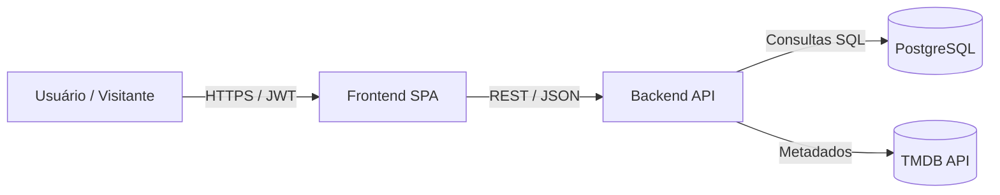

# Resumo Executivo — Arquitetura do Sistema ReelStack

## 1. Visão Geral

O **ReelStack** é uma plataforma web de recomendação e curadoria de filmes, voltada a entusiastas de cinema que desejam descobrir, avaliar e organizar títulos de forma personalizada. O sistema permite ao usuário curtir ou rejeitar filmes por meio de um fluxo de navegação interativo (*swipe*), formar coleções temáticas e compartilhar listas públicas.  
O público-alvo inclui **usuários finais de streaming**, **criadores de conteúdo** e **curadores de filmes independentes**, oferecendo uma experiência gamificada e responsiva em navegadores e dispositivos móveis. O produto prioriza desempenho, segurança e simplicidade de uso, com base em dados integrados à **TMDB API**.

---

## 2. Arquitetura em Alto Nível

A arquitetura adota o modelo **web-first** com **frontend SPA (React)** e **backend RESTful (Node.js)**, sustentado por um **banco PostgreSQL**. O sistema é modular, seguro e escalável, suportando autenticação JWT, comunicação via TLS 1.3 e controle de acesso por políticas RLS.

O design favorece independência entre camadas, permitindo evolução incremental e manutenção isolada por serviços (auth, recomendações, coleções e interações).

---

## 3. Principais Decisões Arquiteturais

- **PostgreSQL como banco principal**, garantindo integridade transacional e suporte a políticas RLS.  
- **TMDB como fonte exclusiva** de metadados de filmes durante o MVP, simplificando integrações.  
- **Representação vetorial em JSONB**, com **migração planejada para pgvector** para otimização futura.  
- **Arquitetura SPA + REST**, assegurando escalabilidade e experiência fluida.  
- **Segurança em múltiplas camadas:** TLS 1.3, JWT e RLS configurados por perfil.  
- **Tratamento centralizado de erros**, com respostas JSON padronizadas e mensagens compreensíveis.  
- **Uso de `timestamptz DEFAULT now()`**, padronizando horários e garantindo consistência temporal.  
Essas decisões refletem o equilíbrio entre **agilidade no MVP** e **preparo para evolução de longo prazo**.

---

## 4. Requisitos Não Funcionais Críticos

| RNF | Categoria | Estratégia Arquitetural de Atendimento |
|------|------------|-----------------------------------------|
| RNF-001 | **Segurança** | TLS 1.3, JWT e RLS garantem autenticação segura e isolamento de dados. |
| RNF-002 | **Desempenho** | p90 ≤ 1s com uso de cache leve, índices e consultas otimizadas. |
| RNF-003 | **Confiabilidade** | Transações ACID e constraints UNIQUE asseguram integridade de dados. |
| RNF-004 | **Usabilidade** | Mensagens padronizadas e feedback rápido nas interações de swipe. |
| RNF-005 | **Manutenibilidade** | Código modular, padronização ESLint/Prettier e documentação OpenAPI. |
A combinação dessas práticas sustenta a operação contínua, a escalabilidade e a clareza operacional do sistema.

---

## 5. Próximos Passos

- **Migração para pgvector:** substituição dos vetores JSONB para consultas vetoriais mais eficientes.  
- **Testes de carga e tuning SQL:** validação de desempenho real com 100+ usuários simultâneos.  
- **Aprimoramento das políticas RLS:** reforço de segurança em dados derivados de perfis e coleções.  
- **Camada de cache distribuída:** uso opcional de Redis ou CDN para respostas frequentes da TMDB.  
- **Expansão internacional:** estrutura preparada para futura tradução e regionalização da interface.  

---
O **ReelStack** apresenta uma base arquitetural sólida, voltada à confiabilidade, desempenho e experiência do usuário. Seu design modular e as decisões tomadas asseguram escalabilidade técnica e evolução sustentável para as próximas versões do produto.
