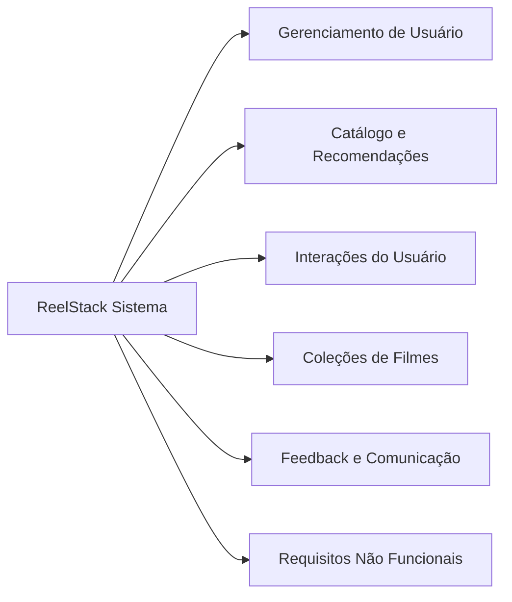
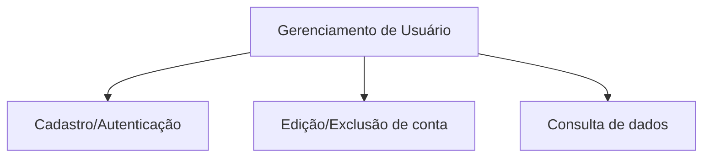
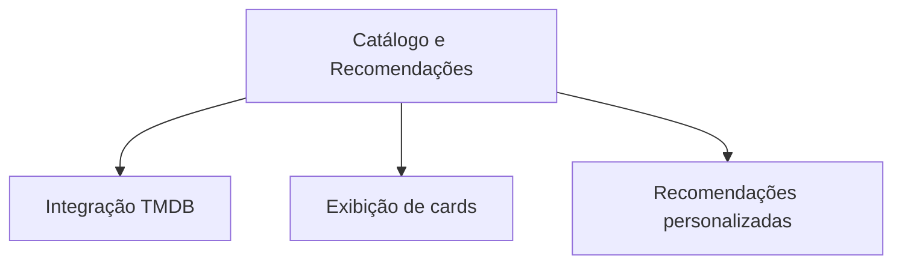
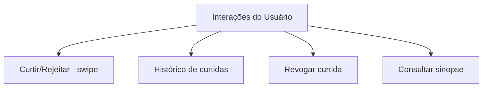
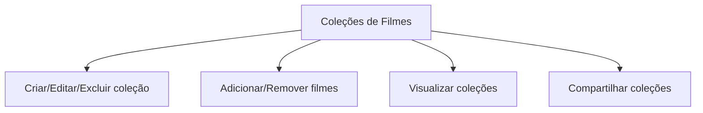
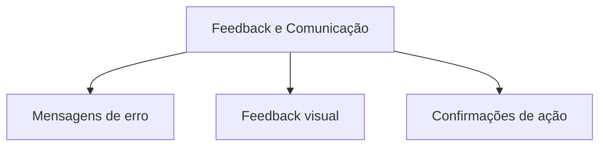
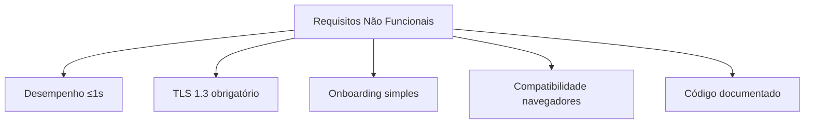

# ReelStack  

**Documento de Requisitos de Software**  
**Grupo:** Felipe Vasconcelos Cardoso, Gabriel de Oliveira Batista, Guilherme Akio Suguino Sampaio, Pedro Lourenço Jovino Martins, Guilherme Nunes Lobo, Victor Assis Oliveira.  
**Data:** 2025-10-13  

---
> 

## Introdução  
### Propósito do documento  
Este documento tem como objetivo definir e consolidar os requisitos do sistema **ReelStack**, servindo como base para as fases de projeto, desenvolvimento, testes e manutenção do software.  
### Definições, acrônimos e abreviações  
- **CRUD** – Create, Read, Update, Delete: operações básicas de manipulação de dados.  
- **TMDB** – The Movie Database: API gratuita utilizada para obter dados de filmes e séries.  
- **MVP** – Produto Mínimo Viável.  
- **Swipe** – Gesto horizontal (arrastar para esquerda/direita) usado para rejeitar ou aceitar sugestões.  
- **Coleção** - Coleção: Lista personalizada de filmes criada pelo usuário, que pode ser editada, visualizada e compartilhada.
- **Histórico de curtidas**: Registro dos filmes que o usuário marcou como favoritos, permitindo consulta posterior.
- **Sinopse**: Resumo textual de um filme, contendo informações como título, ano e descrição, obtido da API TMDB.

### Metodologia de Levantamento de Requisitos
O levantamento de requisitos foi conduzido com base em abordagens colaborativas e centradas no usuário, integrando práticas de _Design Thinking_, _Scrum_ e _User-Centered Design_. Inicialmente, a equipe realizou sessões de discussão em grupo para explorar o problema e levantar hipóteses sobre as necessidades dos usuários. Em paralelo, foi desenvolvida uma prototipagem inicial da interface e do fluxo de navegação, permitindo testes exploratórios e coleta de feedback qualitativo.

Para enriquecer a compreensão do perfil do usuário, foram realizadas entrevistas informais com consumidores reais do serviço, o que possibilitou validar expectativas e ajustar funcionalidades. As informações obtidas foram organizadas em histórias de usuário e estruturadas em um backlog, que passou por ciclos de refinamento e priorização com base em novas discussões internas. Todo o processo foi alinhado às diretrizes metodológicas da disciplina, garantindo coerência entre os objetivos técnicos e pedagógicos do projeto.
  
---

## Visão do Produto
O **ReelStack** é um sistema de recomendação e organização de filmes, com foco em oferecer ao usuário uma experiência dinâmica e personalizada na descoberta de conteúdos audiovisuais.  
Seu principal objetivo é facilitar a escolha do que assistir, tornando o processo mais simples, atrativo e interativo.
### Objetivos principais
- Proporcionar recomendações de filmes personalizadas com base nas interações do usuário (curtidas, rejeições, histórico).  
- Permitir que usuários organizem seus títulos preferidos em **coleções personalizadas**, que podem ser editadas, visualizadas e compartilhadas.  
- Garantir uma experiência fluida e intuitiva, com **interações por swipe**, feedback imediato e mensagens de erro claras.  
- Oferecer informações confiáveis sobre os filmes (título, imagem, ano e sinopse), obtidas exclusivamente da API do **TMDB**.  
### Stakeholders
- **Usuário final** → pessoa que acessa o sistema para descobrir, curtir/rejeitar e organizar filmes em coleções.  
- **Administrador** → responsável por gerenciar dados do sistema e acompanhar métricas de uso.  
- **Equipe de desenvolvimento** → encarregada de implementar, testar e manter o sistema conforme os requisitos especificados.  
### Diferenciais do ReelStack
- Utiliza uma **interface baseada em gestos (swipe)**, tornando a navegação mais intuitiva e próxima da experiência mobile.  
- Integração com a API **TMDB**, garantindo dados sempre atualizados e padronizados.  
- Possibilita a criação e o compartilhamento de coleções, promovendo maior engajamento social e personalização da experiência.  
- Define requisitos funcionais e não funcionais claros, assegurando desempenho, segurança e usabilidade desde o MVP.

---

## Escopo do Sistema
O escopo funcional do **ReelStack** pode ser dividido em cinco grandes módulos principais:
1. **Gerenciamento de Usuário**
  - Cadastro, autenticação e edição de dados do usuário.  
  - Exclusão de conta e gerenciamento de sessão.  
  - Consulta de informações cadastrais e histórico de interações.  
2. **Catálogo e Recomendações**
  - Integração com a API **TMDB** para obtenção de dados de filmes.  
  - Exibição de cards com informações (título, ano, imagem, sinopse).  
  - Sistema de recomendações personalizadas com base em curtidas e rejeições.  
3. **Interações do Usuário**
  - Curtir ou rejeitar filmes via gesto **swipe**.  
  - Histórico de filmes curtidos.  
  - Revogação de curtida.  
  - Consulta da sinopse detalhada de cada filme.  
4. **Coleções de Filmes**
  - Criação, edição e exclusão de coleções personalizadas.  
  - Adição e remoção de filmes em coleções.  
  - Visualização de coleções criadas.  
  - Compartilhamento de coleções por link público.  
5. **Feedback e Comunicação**
  - Exibição de mensagens de erro específicas e claras.  
  - Indicadores de carregamento e feedback de ações concluídas.  
  - Mensagens de confirmação e avisos de status do sistema.  
### Escopo Não Funcional
Além dos módulos funcionais, o sistema contempla requisitos não funcionais críticos, tais como:
- **Desempenho** → resposta de interações (ex.: swipe) em ≤ 1s para 90% das requisições no MVP.  
- **Segurança** → uso obrigatório de TLS 1.3 em toda a comunicação cliente-servidor.  
- **Usabilidade** → onboarding simplificado e mensagens de erro claras.  
- **Compatibilidade** → suporte a navegadores modernos (Chrome, Firefox e Edge).  
- **Manutenibilidade** → código com padrões de nomenclatura e documentação consistente.

---
## Visão geral (alto nível)

---

---

---

---

---

---

---

## Diagrama de casos de uso simplificado

---

### 1.1 Diagrama de casos de Uso - Gerenciamento de Usuário

---

### 1.2 Diagrama de casos de Uso - Interação com Filmes

---

### 1.3 Diagrama de casos de Uso - Coleções

---

##  Escopo Não Funcional / Restrições
Além dos requisitos não funcionais já descritos, o sistema deve respeitar as seguintes restrições:
- **Fonte de dados exclusiva**: Somente a API TMDB será utilizada como provedora de informações de filmes.  
- **Disponibilidade inicial (MVP)**: O produto mínimo viável (MVP) será web first, suportando até **100 usuários simultâneos**.  
- **Escopo de autenticação**: O login será realizado exclusivamente por e-mail e senha (não serão incluídos provedores externos como Google ou Facebook no MVP).  
- **Compatibilidade de navegadores**: O sistema deve ser compatível com as versões estáveis mais recentes de Google Chrome e Mozilla Firefox.  
- **Infraestrutura de backend**: O backend deve ser hospedado em ambiente de nuvem pública, com banco de dados relacional PostgreSQL.  
- **Limitação de persistência**: Não haverá suporte a armazenamento offline no MVP (funcionalidade pode ser considerada em futuras iterações).  

---

##  Premissas e Dependências
O desenvolvimento do sistema **ReelStack** assume as seguintes premissas e depende de fatores externos para seu funcionamento adequado:
### Premissas
- A API **TMDB** estará disponível e manterá seu modelo gratuito de acesso básico durante todo o ciclo do projeto.  
- Os usuários terão conexão estável com a internet, visto que o sistema é totalmente **online**.  
- A infraestrutura de nuvem contratada (servidor e banco de dados) terá disponibilidade mínima de 99%.  
- Os requisitos levantados junto aos stakeholders representam de forma fiel as necessidades iniciais do produto.  
### Dependências
- Dependência da **API TMDB** para fornecimento de informações (títulos, imagens, sinopses, ano de lançamento).  
- Dependência da **infraestrutura de nuvem** (hospedagem backend e banco de dados PostgreSQL).  
- Dependência do **navegador do usuário** para correta renderização da interface web.  
- Dependência da equipe acadêmica/professores para validação dos artefatos de requisitos e feedback contínuo.

---
## Visão geral dos requisitos funcionais  
### Escolha de abordagem  
O projeto utilizará **Histórias de Usuário** para representar os requisitos funcionais.  
### Justificativa  
Essa abordagem foi escolhida por ser adequada ao desenvolvimento incremental e centrado no usuário, permitindo descrever as funcionalidades sob a perspectiva de quem utiliza o sistema.  
A priorização das histórias seguiu a técnica **MoSCoW** (Must, Should, Could, Won’t).  

---
## Seção 1 – Backlog Resumido
| ID   | Título                          | Valor de Negócio                                                   | Prioridade | Estimativa (pts) | Dependências       |
|------|---------------------------------|--------------------------------------------------------------------|------------|------------------|--------------------|
| US01 | Autenticar usuário              | Permite consultar os dados cadastrados do usuário para autenticação| Must       | 3                | N/A                |
| US02 | Cadastrar novo usuário          | Permite armazenamento de preferências                              | Must       | 3                | US01               |
| US03 | Editar usuário                  | Permite atualizar dados do usuário (e-mail e senha)                | Must       | 2                | US01, US02         |
| US04 | Excluir usuário                 | Permite remover conta e dados do usuário                           | Must       | –                | US05, US06, US07   |
| US05 | Consultar usuário               | Permite consultar dados cadastrais e histórico                     | Must       | 3                | US01               |
| US06 | Visualizar filme recomendado    | Início da experiência principal                                    | Must       | 3                | –                  |
| US07 | Curtir/rejeitar filme (swipe)   | Coleta dados para o algoritmo de recomendação                      | Must       | 5                | US06               |
| US08 | Visualizar histórico de curtidas| Permite rever filmes favoritos                                     | Should     | 3                | US07               |
| US09 | Comunicar e feedback ao usuário | Fornece informações claras sobre estados de carregamento           | Should     | –                | –                  |
| US10 | Revogar curtida                 | Permite o usuário remover uma curtida anterior                     | Should     | 2                | US07               |
| US11 | Consultar sinopse de filme      | Permite ver informações detalhadas antes da decisão                | Must       | 2                | US05               |
| US12 | Ver recomendação de filme       | Gera lista personalizada de títulos recomendados                   | Must       | 4                | US06, US11         |
| US13 | Criar coleção                   | Permite organizar filmes em listas personalizadas                  | Must       | 3                | US07               |
| US14 | Editar coleção                  | Permite atualizar nome e descrição de coleções                     | Should     | 2                | US13               |
| US15 | Excluir coleção                 | Permite remover coleções desnecessárias                            | Should     | 2                | US13               |
| US16 | Adicionar item na coleção       | Permite adicionar filmes curtidos a coleções                       | Must       | 3                | US07, US13         |
| US17 | Remover item da coleção         | Permite manter coleções organizadas removendo filmes               | Should     | 2                | US16               |
| US18 | Visualizar coleção              | Permite acessar coleções criadas e seus filmes                     | Must       | 3                | US13, US16         |
| US19 | Compartilhar coleção            | Permite divulgar coleções publicamente via link                    | Could      | 3                | US18               |
---
## Seção 2 – Histórias Detalhadas  
### US01 – Autenticar usuário
**Como** usuário,  
**Quero** autenticar meus dados cadastrados no sistema,  
**Para** garantir acesso seguro às minhas informações e funcionalidades.  
**Critérios de aceite**  
- **Dado** que o usuário já possua cadastro, **quando** inserir credenciais válidas, **então** o sistema deve autenticar e liberar o acesso.  
- **Dado** que o usuário insira credenciais inválidas, **quando** tentar acessar, **então** o sistema deve negar o login e exibir mensagem de erro.  
- **Dado** que o usuário não esteja autenticado, **quando** tentar acessar áreas restritas, **então** o sistema deve redirecioná-lo para a tela de login.
- **Dado** que o usuário não esteja cadastrado, **quando** tentar realizar o login, **então** o sistema deve redirecioná-lo para a tela de cadastro.  
---
### US02 – Cadastrar novo usuário  
**Como** visitante,  
**Quero** me cadastrar com e-mail e senha,  
**Para** poder salvar minhas preferências e utilizar o sistema posteriormente.  
**Critérios de aceite**  
- **Dado** que o visitante preencha o formulário com dados válidos, **quando** clicar em “Cadastrar”, **então** a conta deve ser criada e o usuário redirecionado para a tela inicial.  
- **Dado** que o visitante use um e-mail já existente, **quando** tentar cadastrar, **então** o sistema deve informar que o e-mail já está em uso.  
--- 
### US03 – Editar usuário
**Como** usuário autenticado,  
**Quero** atualizar meus dados cadastrados (como e-mail ou senha),  
**Para** manter minhas informações corretas e seguras.  
**Critérios de aceite**  
- Dado que o usuário esteja autenticado, **quando** acessar a tela de edição de perfil, **então** deve visualizar seus dados atuais.
- Dado que o usuário insira dados válidos, **quando** confirmar a edição, **então** o sistema deve atualizar as informações e exibir mensagem de sucesso.
- Dado que o usuário insira dados inválidos ou em formato incorreto, **quando** tentar salvar, **então** o sistema deve exibir mensagem de erro apropriada.
- Dado que o usuário tente usar um e-mail já existente, **quando** salvar a edição, **então** o sistema deve informar que o e-mail já está em uso.
---
### US04 - Excluir usuário
**Como** usuário autenticado,  
**Quero** excluir minha conta do sistema,  
**Para** encerrar meu uso e remover meus dados pessoais.  
**Critérios de aceite**
- Dado que o usuário esteja autenticado, **quando** acessar a opção de exclusão de conta, **então** deve visualizar uma confirmação antes da ação.
- Dado que o usuário confirme a exclusão, **quando** a ação for concluída, **então** o sistema deve remover os dados e redirecionar para a tela de boas-vindas.
- Dado que o usuário cancele a exclusão, **quando** clicar em “Cancelar”, **então** o sistema deve manter a conta ativa e retornar à tela anterior.
- Dado que a exclusão falhe por erro interno, **quando** detectado, **então** o sistema deve exibir mensagem clara de falha.
---
### US05 – Consultar usuário
**Como** administrador ou sistema,  
**Quero** consultar os dados de um usuário específico,  
**Para** verificar informações cadastrais e interações realizadas.  
**Critérios de aceite**
- Dado que o usuário esteja autenticado, **quando** acessar a área de perfil, **então** deve visualizar seus dados e histórico de interações.
- Dado que o sistema precise validar dados, **quando** houver requisição, **então** deve retornar informações como nome, e-mail, preferências e interações.
- Dado que o usuário não esteja autenticado, **quando** tentar acessar dados pessoais, **então** o sistema deve redirecionar para a tela de login.
- Dado que o usuário não exista, **quando** for feita a consulta, **então** o sistema deve exibir mensagem “usuário não encontrado”.
---
### US06 – Visualizar filme  
**Como** usuário logado,  
**Quero** visualizar cards com informações de filmes recomendados,  
**Para** decidir se me interesso por eles.  
**Critérios de aceite**  
- **Dado** que o usuário esteja autenticado, **quando** acessar a tela de recomendações, **então** deve visualizar cards com título, imagem, ano e sinopse.  
- **Dado** que o usuário interaja (curtir/rejeitar), **quando** concluir a ação, **então** o próximo filme deve ser carregado automaticamente.  
---
### US07 – Curtir filme   
**Como** usuário,  
**Quero** curtir ou rejeitar filmes com um gesto (swipe),  
**Para** treinar o algoritmo de recomendação com base nas minhas preferências.  
**Critérios de aceite**  
- **Dado** que o usuário faça swipe para a direita, **então** o filme deve ser marcado como curtido.  
- **Dado** que o usuário faça swipe para a esquerda, **então** o filme deve ser marcado como rejeitado.  
- **Dado** que o usuário já tenha interagido com o filme, **quando** tentar repetir a ação, **então** o sistema deve impedir duplicidade.  
---
### US08 – Visualizar histórico de curtidas  
**Como** usuário,  
**Quero** acessar uma tela com todos os filmes que já curti,  
**Para** poder rever e procurar esses filmes depois.  
**Critérios de aceite**  
- **Dado** que o usuário tenha curtido filmes, **quando** acessar o histórico, **então** deve visualizar lista com título e imagem.  
- **Dado** que não haja filmes curtidos, **quando** acessar o histórico, **então** o sistema deve exibir mensagem “nenhum item encontrado”.  
- **Dado** que o usuário não esteja autenticado, **quando** tentar acessar o histórico, **então** deve ser redirecionado para o login.  
---
### US09 – Comunicar novidades no catálogo  
**Como** usuário,  
**Quero** receber informações claras sobre o carregamento e estado das ações,  
**Para** ter maior confiança e engajamento ao interagir com o sistema.  
**Critérios de aceite**  
- **Dado** que o sistema esteja processando uma requisição, **quando** houver carregamento, **então** deve exibir indicador visual (ex: spinner).  
- **Dado** que a ação seja concluída com sucesso, **quando** finalizada, **então** deve exibir mensagem de confirmação.  
- **Dado** que ocorra erro, **quando** detectado, **então** deve exibir mensagem clara ao usuário.  
---
### US10 – Revogar curtida
**Como** usuário,  
**Quero** remover a curtida de um filme previamente marcado,  
**Para** que ele não apareça mais no meu histórico de curtidas.  
**Critérios de aceite**  
- **Dado** que o usuário tenha curtido um filme, **quando** acessar os detalhes ou histórico, **então** deve visualizar opção para revogar a curtida.  
- **Dado** que o usuário revogue a curtida, **quando** confirmar a ação, **então** o sistema deve remover o filme do histórico de curtidas.  
- **Dado** que o filme não esteja curtido, **quando** tentar revogar, **então** o sistema deve exibir mensagem “ação inválida”.  
---
### US11 – Consultar sinopse de filme
**Como** usuário,  
**Quero** visualizar a sinopse completa de um filme,  
**Para** decidir melhor se tenho interesse em assisti-lo.  
**Critérios de aceite**  
- **Dado** que o usuário esteja autenticado, **quando** acessar os detalhes do filme, **então** deve visualizar sinopse completa, título, ano e imagem.  
- **Dado** que a sinopse não esteja disponível na fonte (TMDB), **quando** acessar o filme, **então** o sistema deve exibir mensagem “sinopse não disponível”.  
---
### US12 – Ver recomendação de filme
**Como** usuário,  
**Quero** visualizar recomendações personalizadas de filmes,  
**Para** descobrir novos conteúdos com base no meu histórico de interações.  
**Critérios de aceite**  
- **Dado** que o usuário esteja autenticado, **quando** acessar a área de recomendações, **então** o sistema deve exibir uma lista personalizada de filmes recomendados.  
- **Dado** que não haja recomendações disponíveis, **quando** acessar a área, **então** o sistema deve exibir mensagem “nenhuma recomendação encontrada”.  
---
### US13 – Criar coleção
**Como** usuário,  
**Quero** criar novas coleções,  
**Para** organizar filmes em listas personalizadas.  
**Critérios de aceite**  
- **Dado** que o usuário esteja autenticado, **quando** acessar a opção “Criar coleção”, **então** deve poder inserir nome e descrição.  
- **Dado** que o usuário insira dados válidos, **quando** salvar, **então** a coleção deve ser criada com sucesso.  
- **Dado** que o nome da coleção já exista, **quando** tentar salvar, **então** o sistema deve exibir mensagem “nome já utilizado”.  
---
### US14 – Editar coleção
**Como** usuário,  
**Quero** editar nome e descrição de minhas coleções,  
**Para** mantê-las sempre atualizadas.  
**Critérios de aceite**  
- **Dado** que o usuário possua coleções, **quando** acessar “Editar coleção”, **então** deve visualizar os dados atuais.  
- **Dado** que insira novos dados válidos, **quando** salvar, **então** a coleção deve ser atualizada.  
- **Dado** que insira nome já utilizado, **quando** salvar, **então** o sistema deve exibir mensagem “nome já utilizado”.  
---
### US15 – Excluir coleção
**Como** usuário,  
**Quero** excluir coleções criadas,  
**Para** remover listas que não quero mais manter.  
**Critérios de aceite**  
- **Dado** que o usuário possua coleções, **quando** acessar “Excluir coleção”, **então** deve visualizar confirmação antes da exclusão.  
- **Dado** que confirme a exclusão, **quando** finalizada, **então** o sistema deve remover a coleção e todos os vínculos de filmes a ela.  
- **Dado** que cancele a exclusão, **quando** confirmar “Cancelar”, **então** a coleção deve permanecer ativa.  
---
### US16 – Adicionar item na coleção
**Como** usuário,  
**Quero** adicionar filmes curtidos a uma coleção,  
**Para** organizar meus títulos preferidos em listas personalizadas.  
**Critérios de aceite**  
- **Dado** que o usuário tenha curtido filmes, **quando** selecionar um filme e clicar em “Adicionar à coleção”, **então** deve visualizar lista de coleções existentes.  
- **Dado** que o usuário selecione uma coleção, **quando** confirmar a ação, **então** o filme deve ser vinculado a ela.  
- **Dado** que o filme já esteja na coleção, **quando** tentar adicioná-lo novamente, **então** o sistema deve exibir mensagem “filme já incluso”.  
---
### US17 – Remover item da coleção
**Como** usuário,  
**Quero** remover filmes de uma coleção,  
**Para** manter minha lista organizada e atualizada.  
**Critérios de aceite**  
- **Dado** que o usuário possua uma coleção com filmes, **quando** acessar a coleção e escolher “Remover”, **então** o item deve ser excluído.  
- **Dado** que o usuário tente remover filme inexistente na coleção, **quando** confirmar a ação, **então** o sistema deve exibir mensagem “filme não encontrado na coleção”.  
---
### US18 – Visualizar coleção
**Como** usuário,  
**Quero** visualizar minhas coleções com os filmes adicionados,  
**Para** navegar facilmente pelas minhas listas personalizadas.  
**Critérios de aceite**  
- **Dado** que o usuário possua coleções, **quando** acessar a área de coleções, **então** deve visualizar lista com nome, descrição e filmes associados.  
- **Dado** que não haja coleções criadas, **quando** acessar a área, **então** o sistema deve exibir mensagem “nenhuma coleção encontrada”.  
---
### US19 – Compartilhar coleção
**Como** usuário,  
**Quero** compartilhar minhas coleções,  
**Para** que outras pessoas possam visualizar meus filmes organizados.  
**Critérios de aceite**  
- **Dado** que o usuário possua coleções, **quando** clicar em “Compartilhar”, **então** deve ser gerado link público de visualização.  
- **Dado** que outro usuário acesse o link, **quando** a coleção for pública, **então** deve visualizar título, descrição e lista de filmes.  
- **Dado** que a coleção tenha sido excluída ou tornada privada, **quando** acessar o link, **então** deve exibir mensagem “coleção indisponível”.
---
## Lista de Regras de Negócio  

### RN-001 – Recomendação não repetida  
- **Descrição:** Um filme rejeitado por um usuário não deverá ser incluído nas recomendações desse usuário nos próximos **60 dias** contados a partir da data de rejeição. Exceções só poderão ocorrer mediante ação explícita do usuário (p.ex. "reavaliar recomendações") ou campanhas de reengajamento autorizadas pelo administrador, que devem ser registradas e apresentadas ao usuário 
- **Objetivo:** Garantir que a experiência de recomendação seja personalizada e não repetitiva.  
- **Fonte/autoridade:** Política de recomendação do ReelStack, versão 1.0.  
- **Impacto:** Requisito US05 – Visualizar filme recomendado; US06 – Curtir/rejeitar filme.  
---
### RN-002 – Interação única por filme  
- **Descrição:** Cada usuário mantém no máximo um registro ativo de reação (curtiu / rejeitou) por filme. Se o usuário mudar de opinião, o registro deve ser atualizado (campo reaction, update_at) - não criado duplicadamente.
- O histórico de interações deve ser preservado para fins analíticos (audit trail).
  - Se um filme for re-sugerido após o período definido em RN-001, o sistema não deve apagar automaticamente o histórico anterior; permite-se que o usuário atualize a reação se desejar.
- **Objetivo:** Evitar duplicidade de registros que possam distorcer o algoritmo de recomendação.  
- **Fonte/autoridade:** Lógica de integridade do banco de dados.  
- **Impacto:** Requisito US06 – Curtir/rejeitar filme; US05 – Salvar interação no backend.  
---
### RN-003 – Acesso restrito ao histórico  
- **Descrição:** Apenas usuários autenticados podem acessar o histórico de filmes curtidos.  
- **Objetivo:** Garantir segurança e privacidade dos dados de preferência do usuário.  
- **Fonte/autoridade:** Política mínima de autenticação para acesso a dados personalizados.  
- **Impacto:** Requisito US07 – Visualizar histórico de curtidas.  
---
### RN-004 – Dados mínimos obrigatórios do filme  
- **Descrição:** Todo filme exibido deve conter, no mínimo, título, imagem, ano de lançamento e sinopse.  
- **Objetivo:** Assegurar consistência nas informações apresentadas e melhor experiência de navegação.  
- **Fonte/autoridade:** Estrutura da API TMDB.  
- **Impacto:** Requisito US05 – Visualizar filme recomendado.  
---
### RN-005 – Fonte de dados exclusiva  
- **Descrição:** Todos os dados de filmes e séries devem ser obtidos exclusivamente da API oficial do TMDB.  
- **Objetivo:** Garantir padronização, confiabilidade e atualização contínua das informações.  
- **Fonte/autoridade:** Decisão técnica de integração, Documento de Visão v1.0.  
- **Impacto:** Requisitos US05 – Visualizar filme recomendado; US06 – Curtir/rejeitar filme.  
---
### RN-006 – Validação obrigatória de campos  
- **Descrição:** O sistema deve validar o preenchimento de campos obrigatórios (e-mail e senha) antes de permitir cadastro ou login.  
- **Objetivo:** Prevenir falhas de autenticação e melhorar a experiência de uso.  
- **Fonte/autoridade:** Boas práticas de UX e validação de entrada.  
- **Impacto:** Requisitos US02 – Cadastrar novo usuário; US03 – Fazer login.  
---
### RN-007 – Mensagem de erro obrigatória
- **Descrição:** Toda operação que falhar (login inválido, erro de carregamento, tentativa duplicada) deve gerar mensagem clara e específica ao usuário. As mensagens devem ser visíveis, objetivas e evitar termos técnicos confusos.
- **Objetivo:** Garantir feedback adequado para que o usuário compreenda a falha e saiba como agir.
- **Fonte/autoridade:** Diretriz de usabilidade e feedback visual do sistema.
- **Impacto:** Em todas as histórias de usuário.
---

## Anexo 01 – Mensagens do Sistema

| Código | Mensagem                                                                 |
|--------|--------------------------------------------------------------------------|
| M001   | Usuário ou senha digitados está inválido! Tente novamente               |
| M002   | E-mail informado inválido, verifique a digitação do seu e-mail          |
| M003   | Erro ao redirecionar à página selecionada. Favor entrar em contato com o administrador do sistema |
| M004   | Erro inesperado. Favor entrar em contato com o administrador do sistema |
| M005   | Campos obrigatórios não preenchidos. Verifique e tente novamente.       |
| M006   | Não foi possível adicionar o filme à coleção: filme já existente.       |
| M007   | Nome da coleção já está em uso. Escolha outro nome.                     |
| M008   | Sinopse não disponível para este título.                                |
| M009   | Ação inválida. Verifique se o item selecionado existe.                  |

---

## Tabela Resumo RNFs

| ID      | Título                                      | Classificação       | Critério de Aceitação                          |
|---------|---------------------------------------------|----------------------|-----------------------------------------------|
| RNF001  | Desempenho: Tempo de Resposta ao Swipe     | Eficiência           | Percentil 90 ≤ 1s em teste de carga          |
| RNF002  | Segurança: Criptografia em Trânsito        | Segurança            | OWASP ZAP sem falhas críticas                |
| RNF003  | Usabilidade: Fluxo de Onboarding           | Usabilidade          | ≥ 85% concluem cadastro + 1ª interação ≤ 5min|
| RNF004  | Compatibilidade: Suporte a Navegadores     | Compatibilidade      | 100% das funções operam nos navegadores      |
| RNF005  | Usabilidade: Mensagens de Erro             | Usabilidade          | 100% dos casos exibem mensagem adequada      |

## Lista de Requisitos Não Funcionais  

### RNF 001 – Desempenho: Tempo de Resposta ao Swipe
- **Descrição:** O sistema deve responder à interação de swipe (curtir/rejeitar) em ≤ 1 s para 90 % das requisições, considerando até 100 usuários simultâneos no MVP.
- **Classificação:** Eficiência de desempenho
- **Método de verificação:** Teste de carga com JMeter simulando 100 usuários concorrentes
- **Critério de aceitação:** Relatório de testes demonstra percentil 90 ≤ 1 s
- **Impacto na arquitetura:** Requer uso de endpoints otimizados e baixo acoplamento entre frontend e backend
---

### RNF 002 – Segurança: Criptografia em Trânsito

- **Descrição:** Toda comunicação entre cliente e servidor deve ser protegida com `TLS 1.3` e certificado digital válido emitido por autoridade certificadora confiável.
- **Classificação:** Segurança
- **Método de verificação:** Auditoria de configuração `HTTPS` e scanner de segurança (`OWASP ZAP`)
- **Critério de aceitação:** OWASP ZAP não deve identificar falhas críticas ou de alto risco na criptografia
- **Impacto na arquitetura:** Exige configuração de servidor com `HTTPS` forçado e biblioteca cliente compatível com `TLS 1.3`

---

### RNF 003 – Usabilidade: Fluxo de Onboarding

- **Descrição:** Usuários iniciantes devem concluir o cadastro e a primeira interação com o sistema em ≤ 5 min, com taxa de sucesso ≥ 85 % em teste moderado.
- **Classificação:** Usabilidade
- **Método de verificação:** Teste de usabilidade com 20 participantes representativos
- **Critério de aceitação:** ≥ 17 participantes concluem com sucesso em até 5 min
- **Impacto na arquitetura:** Interfaces simples, navegação linear e feedback visual devem estar implementados

---

### RNF 004 – Compatibilidade: Suporte a Navegadores

- **Descrição:** O sistema deve funcionar corretamente nas versões estáveis mais recentes dos navegadores Google Chrome, Mozilla Firefox e Microsoft Edge.
- **Classificação:** Compatibilidade
- **Método de verificação:** Teste manual de interface com checklist funcional por navegador
- **Critério de aceitação:** 100 % das funcionalidades devem operar sem erros em todos os navegadores indicados
- **Impacto na arquitetura:** O frontend deve seguir padrões web modernos e evitar recursos incompatíveis

---

### RNF 005 – Usabilidade: Mensagens de Erro

- **Descrição:** O sistema deve exibir mensagens de erro claras e específicas ao usuário em falhas como login inválido, campos não preenchidos ou falha de rede.
- **Classificação:** Usabilidade
- **Método de verificação:** Testes manuais com cenários de erro comuns
- **Critério de aceitação:** 100 % dos casos simulados devem resultar em mensagem adequada e compreensível
- **Impacto na arquitetura:** Necessita de tratamento centralizado de exceções e mensagens pré-definidas no frontend

---

### RNF 006 – Manutenibilidade: Qualidade do Código

- **Descrição:** O código-fonte deve seguir convenções de nomenclatura e conter comentários explicativos em 100 % das funções públicas.
- **Classificação:** Manutenibilidade
- **Método de verificação:** Auditoria de código e checklist de conformidade
- **Critério de aceitação:** Nenhuma função ou classe pública sem documentação até o fechamento do projeto
- **Impacto na arquitetura:** Padrões de codificação e boas práticas devem ser seguidos desde a primeira sprint

---

  
  

